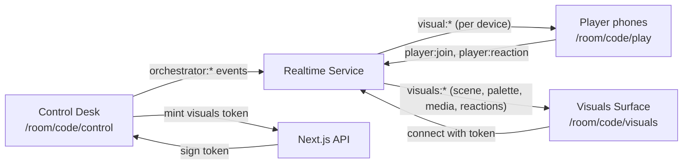
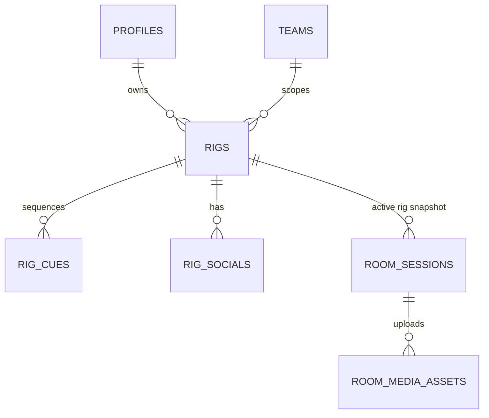
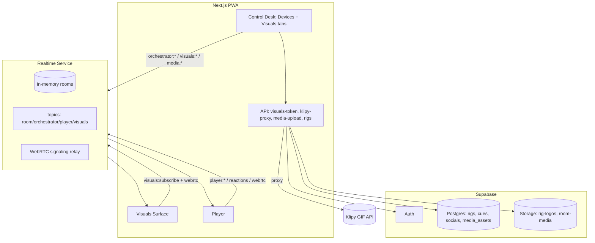

# Glow Architecture (v2)

This document is the technical source of truth for the **second wave** of Glow features:
the visuals projection surface, rigs, the two-tab control desk, audience
reactions, orchestrator media broadcasting, layered presets, device flash control,
and WebRTC live calls.

It complements (does not replace) the existing docs:

- [product-intent.md](./product-intent.md) — product rules and the v1 architecture.
- [preset-refactoring.md](./preset-refactoring.md) — preset registry refactor.
- [strategy.md](./strategy.md) — phase tracker.
- [deployment.md](./deployment.md) — production deployment.
- [plans.md](./plans.md) — plan catalog and feature gating.
- [features/00-feature-index.md](./features/00-feature-index.md) — numbered feature specs.

> Convention: this doc and the `features/*` docs are written in English to stay
> consistent with `product-intent.md`. Code identifiers and comments stay English.

---

## 1. What changes in v2

v1 proved the core loop: an orchestrator creates a room, anonymous players become
light surfaces, and the orchestrator drives colors/presets through a separate
realtime service.

v2 adds four big ideas:

1. **A third surface — the Visuals surface.** A full-screen, music/data-reactive
   canvas the DJ pushes to a projector (separate computer or a second browser tab).
   It is driven from the control desk over a new realtime topic.
2. **Rigs.** The DJ's whole preconfigured setup, saved and reloadable: a cue list of
   visual arts (advanced with **Next**), console layout/preferences, a 1–4 color
   palette, optional logo, social links, and an open `metadata` bag. Rigs personalize
   presets and the visuals surface. See the naming note in §6.
3. **A richer control desk.** Two tabs: **Devices** (the existing matrix/desk) and
   **Visuals** (control of the visuals surface, including the rig cue list + Next).
   Live palette editing with a "save to rig" action.
4. **Richer broadcasting.** Custom images, sequenced text, GIFs (Klipy), audience
   emoji reactions, phone flash/torch control, layered/mixed effects, and an
   optional WebRTC live-call mosaic.

---

## 2. Surfaces

Glow now has **four** client surfaces. Each is a different role on the same room.

| Surface | Route | Auth | Realtime role | Purpose |
| --- | --- | --- | --- | --- |
| Control desk | `/room/[code]/control` | Supabase session (orchestrator) | `orchestrator:{code}` | Drive devices + visuals |
| Player | `/room/[code]/play` | Anonymous (nickname) | `room:{code}`, `player:{publicId}` | Phone = light surface, sends reactions |
| **Visuals** | `/room/[code]/visuals` | **Signed visuals token** | `visuals:{code}` (consumer) | Projector / big screen output |
| QR | `/room/[code]/qr` | Public | — | Static join QR |

The Visuals surface is **output-only** by default: it renders what the control desk
sends and the reactions players send. It does not control the room.



### 2.1 Why a separate Visuals surface

- The projector output and the desk often run on the **same machine** (two tabs /
  two windows) or on **two machines** (laptop drives, desktop projects).
- The visuals canvas is heavy (WebGL shaders, GIF decoding, reaction animations) and
  should not share a render thread with the desk UI.
- It lets the DJ open visuals on any screen by URL without exposing desk controls.

---

## 3. Realtime topics (rooms / namespaces)

The realtime service uses Socket.io rooms as topics. v1 topics stay; v2 adds the
visuals topic and reaction routing.

| Topic | Members | Direction | Notes |
| --- | --- | --- | --- |
| `room:{code}` | all clients in room | server → all | broad visual events |
| `orchestrator:{code}` | desk only | server → desk | `room:state` |
| `player:{publicId}` | one device | server → device | targeted device events |
| **`visuals:{code}`** | visuals surfaces | server → visuals | scene, palette, media, reactions, live-call layout |

### 3.1 Event families

New event prefixes introduced in v2 (full payloads live in each feature doc):

- `orchestrator:visuals_*` — desk → server, control of the visuals surface.
- `visuals:*` — server → visuals surface (scene, palette, logo, media, reaction, layout).
- `player:reaction` — player → server (emoji), validated then fanned out to
  `visuals:{code}` (and optionally `orchestrator:{code}` for moderation counts).
- `orchestrator:media_*` — desk → server, image/text/GIF broadcast to devices.
- `visual:torch` / `device:torch` — flash/torch control to player devices.
- `webrtc:*` — signaling relay for the live-call mosaic.

### 3.2 Visuals authentication

The Visuals surface must be openable on **another computer** by URL, so it cannot
rely solely on the Supabase cookie. Flow:

1. The control desk requests a **signed visuals token** from a Next.js API route
   (`POST /api/rooms/[code]/visuals-token`). The route verifies the Supabase session
   and that the user owns the room session, then signs a short-lived **HMAC-SHA256**
   token over `{ roomCode, sessionId, scope: 'visuals', exp }` with a server secret
   (implemented as HMAC, not a full JWT library).
2. The desk shows a copyable URL / QR: `/room/[code]/visuals#token=...`
   (token in the fragment so it is not logged by servers/proxies).
3. The Visuals surface connects to the realtime service and emits
   `visuals:subscribe { roomCode, token }`. The realtime service verifies the token
   signature + expiry and joins the socket to `visuals:{code}` as a consumer.
4. Tokens are short-lived (e.g. 6h) and bound to the room session; closing the room
   invalidates the topic.

> The realtime service already validates Supabase access tokens for orchestrators
> (`realtime/src/auth.ts`). The visuals token is a **separate, narrower** credential
> signed by the web app with a shared secret (`VISUALS_TOKEN_SECRET`), so the
> realtime service can verify it without a Supabase round-trip.

---

## 4. Data model additions

v2 introduces user-owned configuration and (optionally) uploaded media. All new
tables hang off the existing `profiles` (auth user) and `teams` tables.



New tables (full column lists in [features/02-rigs.md](./features/02-rigs.md)
and [features/06-orchestrator-media.md](./features/06-orchestrator-media.md)):

| Table | Purpose |
| --- | --- |
| `rigs` | A saved DJ setup: name, default art, palette (1–4), logo, `console_config`, `metadata`, `schema_version`, flags |
| `rig_cues` | Ordered cue list of visual arts (advanced with Next), per-cue params + transition |
| `rig_socials` | N social links per rig (typed, repeatable, enabled flag, free `other` links) |
| `room_media_assets` | Uploaded images (≤1MB) for a room session, stored in Supabase Storage |

Storage:

- Logos and uploaded images live in **Supabase Storage** buckets
  (`rig-logos`, `room-media`). The DB stores references (bucket + path), not blobs.
- GIFs are **not** stored: they are referenced by Klipy slug/URL (see
  [features/06-orchestrator-media.md](./features/06-orchestrator-media.md)).

### 4.1 Entitlement keys added in v2

These extend the existing `plan_entitlements` model. Defaults must be safe (off).

| Key | Type | Meaning |
| --- | --- | --- |
| `visuals_surface` | boolean | Can open the Visuals projection surface |
| `available_visual_arts` | string[] | Visual art ids unlocked (registry-backed) |
| `max_rigs` | number | How many rigs a user can save |
| `audience_reactions` | boolean | Players can send emoji reactions |
| `custom_media_upload` | boolean | Can broadcast uploaded images |
| `sequenced_text` | boolean | Can broadcast scrolling/sequenced text |
| `gif_broadcast` | boolean | Can search + broadcast Klipy GIFs |
| `device_flash_control` | boolean | Can control phone torch/flash |
| `effect_layering` | boolean | Can stack/mix multiple effects |
| `webrtc_live_call` | boolean | Can start a WebRTC mosaic |
| `max_live_call_devices` | number | Max devices in a live call |

See [plans.md](./plans.md) for which tier unlocks each key.

### 4.2 Entitlement resolution at runtime (UI vs room snapshot)

A room session stores an **entitlement snapshot** taken when it was created
(`roomState.entitlements`). This can go stale: a team that upgrades (e.g. to Pro) mid-set,
or an old room created before a seed, would show wrong gates if the UI trusted only the
snapshot.

Resolution rule (client): merge **defaults → room snapshot → team plan from API**, where the
live team plan wins:

```ts
// web/lib/entitlements-defaults.ts → mergeEntitlementsForUi(room, team)
entitlements = { ...DEFAULT_ENTITLEMENTS, ...roomState.entitlements, ...teamFromApi };
```

- The team plan comes from `GET /api/user` via the SWR hook
  `web/lib/glow/use-team-entitlements.ts`.
- `mergeEntitlementsForUi` lives in `web/lib/entitlements-defaults.ts` (not
  `@/lib/entitlements`) so **client components don't pull in server-only code** (Drizzle/
  Postgres → "Can't resolve 'fs'").
- **Server side:** `room-manager.ts` calls `refreshRoomEntitlementsFromTeam()` on
  `orchestrator:rejoin_room` and on visuals/live-call handlers, so the server doesn't reject
  actions using a stale snapshot after an upgrade. Reloading the control desk (rejoin) is
  enough to refresh.

---

## 5. Service responsibilities (v2 deltas)

### Next.js PWA

Adds:

- Visuals surface route + renderer.
- Rig CRUD UI + API (cues + socials + logo).
- Visuals-token minting API route.
- Klipy proxy API route (keeps the Klipy key server-side, adds attribution).
- Image upload API (size/type validation, Supabase Storage).
- **Control Device surface** (`/room/[code]/control-device`): a touch-first, operate-only
  console for phone/tablet. Reuses the desk controls in `mode="operate"` (no rig/sequence
  CRUD). Reached via a "Phone Mode" QR on the desktop desk. **Auth:** must rejoin as the
  authenticated room owner — see
  [improvements/07-orchestrator-auth-hardening.md](./improvements/07-orchestrator-auth-hardening.md).

### 5.1 Clock sync (scheduled effects across devices)

Scheduled actions (`visual:color`/preset transitions, torch pulse/strobe) fire on a shared
`targetTimestamp`. To align devices with different clocks, the client estimates a
`clockOffset` (NTP-style over the socket using `serverTime` + measured latency) in
`web/lib/glow/use-orchestrator-delay.ts` and feeds it into `visual-engine.ts` (computes
`now = Date.now() + clockOffset`) and `torch.ts` (subtracts the offset when scheduling), so
flashes/transitions land together on every screen.

### Realtime service

Adds:

- `visuals:{code}` topic + visuals-token verification.
- Reaction validation (allowlist + rate limit) and fan-out.
- Media broadcast routing (image/text/GIF → devices, scene/palette → visuals).
- Torch control routing.
- WebRTC signaling relay (offer/answer/ICE).

It still owns **no rendering** and persists no high-frequency events.

### Supabase

Adds:

- `rigs`, `rig_cues`, `rig_socials`, `room_media_assets` tables.
- Storage buckets `rig-logos`, `room-media` with RLS (owner-only writes).

### New third parties

- **Klipy** — GIF search/serve (`api.klipy.com`). Server-side key, attribution
  required. See [features/06-orchestrator-media.md](./features/06-orchestrator-media.md).
- **WebRTC: mesh only (no SFU).** Live-call uses a peer mesh (publishers → visuals surface)
  via the realtime SDP/ICE relay; LiveKit/mediasoup are explicitly out of scope (decision
  2026-06-08, see [features/09-webrtc-live-call.md](./features/09-webrtc-live-call.md)).
  See [features/09-webrtc-live-call.md](./features/09-webrtc-live-call.md).

---

## 6. Naming: "Rig" (decided)

The saved DJ configuration is the **Rig** — the DJ's whole preconfigured setup (cue
list of visual arts + console layout/preferences + palette + logo + socials + open
`metadata`). It is **not** the auth user (`profiles`) and **not** a visual effect
(`presets`), so it needs its own name. "Rig" (a VJ/DJ's configured console + content)
is distinctive, collision-free, and reads naturally ("load my rig").

| Layer | Name |
| --- | --- |
| DB tables | `rigs`, `rig_cues`, `rig_socials` |
| Code type | `Rig`, `RigCue`, `RigSocial`, `RigConsoleConfig` |
| UI label | **"Rig"** (e.g. "My Rigs", "Load rig") |
| Live edits | **"Overwrite Rig" / "Save as new"** (the requested overwrite button) |

Alternatives considered and rejected: `Show`/`Set` (runner-up `Show`, but "show" reads
as a verb in code; `Set` collides with the data structure), `Profile`/`Preset`
(collide with the auth user and effects). Full model: [features/02-rigs.md](./features/02-rigs.md).

---

## 7. End-to-end picture (v2)



---

## 8. Implementation order (high level)

The detailed, plan-gated order lives in [plans.md](./plans.md) and the
`features/*` docs. At the architecture level the safe order is:

1. **Preset registry mixing** ([07](./features/07-preset-mixing-engine.md)) —
   foundation for palette-driven and layered effects.
2. **Rigs** ([02](./features/02-rigs.md)) — data model + CRUD; nothing
   else can be "saved to a rig" without it.
3. **Visuals surface + topic** ([01](./features/01-visuals-surface.md)) — the new
   output target and realtime topic.
4. **Control desk tabs** ([03](./features/03-control-panel-tabs.md)) — wires desk to
   the visuals topic, the rig cue list, and palette editing.
5. **Player identity + controls** ([04](./features/04-player-identity-and-controls.md)).
6. **Audience reactions** ([05](./features/05-audience-reactions.md)).
7. **Orchestrator media** ([06](./features/06-orchestrator-media.md)).
8. **Device flash control** ([08](./features/08-device-flash-control.md)).
9. **WebRTC live call** ([09](./features/09-webrtc-live-call.md)) — most complex, last.

---

*Created alongside the v2 feature docs. Reflects codebase after preset registry
(`packages/glow-presets`), audio-reactive preset, broadcast color, and reconnect work.*
