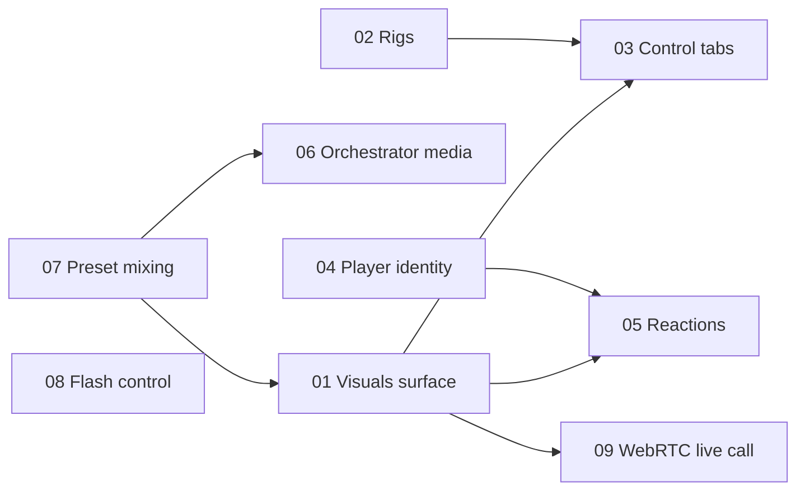

# Glow v2 Feature Index

This folder holds **one numbered spec per feature**. Each spec is self-contained and
written to be picked up in a fresh chat to produce an implementation plan, then build
and verify the feature step by step.

Read first:

- [../architecture.md](../architecture.md) — v2 system architecture.
- [../plans.md](../plans.md) — plan gating for every feature.
- [../improvements/00-index.md](../improvements/00-index.md) — post-demo fixes & enhancements on top of these features.
- [../visuals-architecture.md](../visuals-architecture.md) — how visuals render today (as-is), base for the redesign.

---

## How to use these docs

1. Pick a feature below.
2. Open its doc. Each doc has the same sections:
   - **Summary** — one paragraph.
   - **Plan gating** — entitlement keys (links to `plans.md`).
   - **Concepts & data model** — types, tables, payloads.
   - **Realtime topics & events** — exact event names + payloads.
   - **UI / UX** — screens, components, copy.
   - **Implementation phases** — shippable, checkbox steps.
   - **Files to touch** — concrete paths in this repo.
   - **Acceptance criteria** — how to verify.
   - **Open questions**.
3. Turn the **Implementation phases** into a plan and execute phase by phase.

---

## Feature catalog

| # | Feature | Doc | Depends on | Plan floor | Complexity |
| --- | --- | --- | --- | --- | --- |
| 01 | Visuals projection surface | [01](./01-visuals-surface.md) | 07 (palette params) | Plus 25 | High |
| 02 | Rigs (cue list + console + palette + logo + socials) | [02](./02-rigs.md) | — | Free (1) | Medium |
| 03 | Control desk: Devices + Visuals tabs | [03](./03-control-panel-tabs.md) | 01, 02 | Plus 25 | Medium |
| 04 | Player identity & controls (nickname, exit, share) | [04](./04-player-identity-and-controls.md) | — | Free | Low |
| 05 | Audience emoji reactions | [05](./05-audience-reactions.md) | 01, 04 | Free* | Medium |
| 06 | Orchestrator media (image, text, GIF, targeting) | [06](./06-orchestrator-media.md) | 07 | Plus 50 | High |
| 07 | Pattern sequences (palette + weighted effect distribution) | [07](./07-preset-mixing-engine.md) | — | Free (1) / multi: Plus 50 | High |
| 08 | Device flash / torch control | [08](./08-device-flash-control.md) | — | Plus 25 | Low |
| 09 | WebRTC live-call mosaic | [09](./09-webrtc-live-call.md) | 01 | Pro | Very high |

\* Reactions are available on Free with tighter limits — see [plans.md](../plans.md) §4.

---

## Dependency graph

Recommended build order: **07 → 02 → 01 → 03 → 04 → 05 → 06 → 08 → 09**
(see [../architecture.md](../architecture.md) §8 for rationale).

---

## Status legend (fill in as you go)

| State | Meaning |
| --- | --- |
| `spec` | Documented here, not started |
| `planned` | Implementation plan written in a chat |
| `wip` | In progress |
| `done` | Shipped + verified |

| # | Feature | State |
| --- | --- | --- |
| 01 | Visuals surface | **done** (2026-06-07) |
| 02 | Rigs | **done** (2026-06-07) — schema + CRUD + editor (info/cues/socials/console) + realtime room-load + `max_rigs` gate |
| 03 | Control tabs | **done** (2026-06-07) — Devices/Visuals tabs, cue list + Next, live palette/logo, Overwrite Rig; `console_config` visibility + `/room/new` rig picker deferred |
| 04 | Player identity | **done** (2026-06-08) — mandatory nickname gate + persist/prefill; top-right HUD toolbar (share/QR/fullscreen/exit). Reactions bar → 05 |
| 05 | Reactions | **done** (2026-06-08) — player toolbar + server validation/rate-limit/boost + surface overlay with coalescing |
| 06 | Orchestrator media | **done** (2026-06-08) — text + GIF (Klipy) overlays + targeting + media layer; image upload backend done, desk image UI deferred (TODO) |
| 07 | Pattern sequences | **done** (2026-06-08) — saved sequences + weighted `run_distribution`; `max_pattern_sequences` + `effect_layering` gates; embedded preview + audience-split |
| 08 | Flash control | **done** (2026-06-08) — push-to-flash desk (Hold Pulse/Strobe) + player opt-in/manual flash + screen-flash fallback + strobe-preset torch sync |
| 09 | WebRTC live call | **done** (2026-06-08) — mesh publisher→surface, consent, PiP/Half/2×2/3×3 layouts, gated Pro (≤6). Phase 4 shipped: TURN via `/api/webrtc/ice-servers` (Metered) + ICE-restart/re-offer resilience. SFU (Phase 5) intentionally not planned |
