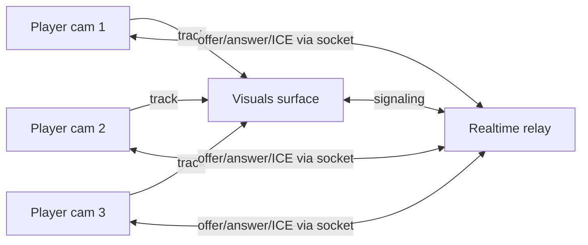

# 09 — WebRTC Live-Call Mosaic

## Summary

The "moonshot": the DJ selects **N player devices** and starts a **live call**. Those
devices publish their **camera (and optionally mic)** and the streams are shown as a
**mosaic on the visuals surface** ([01](./01-visuals-surface.md)) — a live "crowd cam"
wall the DJ can curate in real time.

This is the most complex feature and should be built **last**. The realtime service
acts as the **signaling relay**; for more than a few simultaneous publishers, an
**SFU** (Selective Forwarding Unit) is strongly recommended over a peer mesh.

---

## Plan gating

| Key | Effect |
| --- | --- |
| `webrtc_live_call` | Can start a live call (Pro) |
| `max_live_call_devices` | Max simultaneous publishers (e.g. 6) |

---

## Concepts & topology

### Why an SFU

- **Mesh** (every peer connects to every other) is O(n²) connections and uplinks. Fine
  for **N ≤ 3–4** publishers to a single viewer (the surface).
- For the Glow shape — **N publishers → 1 viewer (the surface)** — a **star to the
  surface** is actually feasible as a mesh if the surface is the only subscriber: each
  selected device sends one stream to the surface. That is N peer connections on the
  surface, which is OK for small N.
- For robustness, multiple viewers (surface + monitor), and larger N, use a managed
  **SFU**: **LiveKit** (recommended, has a hosted option + open source) or
  **mediasoup** (self-hosted, more work).

**Decision (2026-06-08): mesh, no SFU.** We use a **mesh** — publishers → visuals surface
only — capped at `max_live_call_devices` (e.g. ≤ 4–6). **LiveKit/mediasoup are explicitly
out of scope**: an SFU complicates the stack (extra service, tokens, ops, cost) for little
gain at the N publishers → 1 viewer shape we target. The realtime service stays a pure
SDP/ICE relay. If we ever need many viewers or large N, revisit — but not now.



### Signaling (over the existing socket)

The realtime service relays SDP/ICE; it does **not** process media.

```ts
export type WebrtcRole = 'publisher' | 'viewer'; // device publishes, surface views

export type WebrtcSignal =
  | { type: 'offer'; sdp: string }
  | { type: 'answer'; sdp: string }
  | { type: 'ice'; candidate: RTCIceCandidateInit };
```

### TURN/STUN

- STUN (e.g. Google public STUN) for NAT discovery — always present.
- **TURN is required** for reliable connectivity on mobile networks (symmetric NAT).
  Use a managed TURN (e.g. Cloudflare/Twilio/coturn) — needed for real venues.
- Server-side env: `TURN_URL`, `TURN_URLS`, `TURN_USERNAME`, `TURN_CREDENTIAL`.
- Runtime fetch: `GET /api/webrtc/ice-servers` returns `{ iceServers, iceTransportPolicy }`.
- Relay-only testing: `WEBRTC_ICE_TRANSPORT_POLICY=relay` or `TURN_RELAY_ONLY=true`.

---

## Realtime topics & events

| Direction | Event | Payload |
| --- | --- | --- |
| desk → server | `orchestrator:live_call_start` | `{ roomCode, publisherIds: string[] }` |
| desk → server | `orchestrator:live_call_stop` | `{ roomCode, publisherIds?: string[] }` |
| desk → server | `orchestrator:live_layout` | `{ roomCode, tiles: LiveTile[] }` |
| server → device | `webrtc:publish_request` | `{ callId, withAudio }` (player must opt in) |
| server → visuals | `visuals:live_layout` | `{ tiles: LiveTile[] }` |
| relay (both ways) | `webrtc:signal` | `{ callId, from, to, signal: WebrtcSignal }` |
| device → server | `webrtc:publish_ready` / `player:live_decline` | `{ callId }` |

```ts
type LiveTile = { publicId: string; x: number; y: number; w: number; h: number; z: number };
```

Server gates `live_call_start` on `webrtc_live_call` and caps `publisherIds.length` to
`max_live_call_devices`.

### Consent

A device **must opt in** before publishing camera/mic (permission + explicit accept on
the player). The DJ "requests" devices; players accept or decline.

---

## UI / UX

### Player

- On `webrtc:publish_request`: a modal "The DJ wants to show your camera on the big
  screen — Allow / Decline" (+ audio sub-toggle). On allow: `getUserMedia`, publish,
  show a "you're live" indicator + a stop button.

### Desk (Visuals tab)

- Device multiselect (reuse target selector [06](./06-orchestrator-media.md)) → "Go
  live". Shows per-device status: requested / live / declined.
- Layout editor for the mosaic (grid presets: 1, 2x2, 3x3; or freeform tiles) →
  `orchestrator:live_layout`.
- Stop all / stop one.

### Visuals surface

- Renders a `<video>` per live tile per `visuals:live_layout`, composited above/below
  the active art (configurable). Handles join/leave gracefully.

---

## Implementation phases

> Build last. Each phase is a real milestone; do not skip TURN before a venue test.

### Phase 1 — Signaling relay ✅ (2026-06-08)

- [x] `webrtc:signal` relay + `live_call_start/stop` + per-device consent events in
      `room-manager.ts`. Publisher status: requested / live / declined.

### Phase 2 — Single publisher → surface ✅ (2026-06-08)

- [x] Player consent modal + `getUserMedia` + offer; surface answers and shows 1 live tile.
      STUN only (LAN). Surface is the only viewer.

### Phase 3 — Multi-publisher mesh + layout ✅ (2026-06-08)

- [x] Up to `max_live_call_devices` (6 on Pro) publishers; live `LiveTile` layouts with
      presets **PiP / Half / 2×2 / 3×3** + "Apply layout" (recomposes without restart).
      Handles decline + disconnect (tile removed, mosaic continues). `surface_reconnect`:
      a late-opening surface gets the layout and publishers re-offer automatically.

### Phase 4 — TURN + resilience ✅ (2026-06-08)

- [x] Runtime ICE config via `/api/webrtc/ice-servers` (`TURN_URL`, `TURN_URLS`,
      `TURN_USERNAME`, `TURN_CREDENTIAL`, relay-only policy).
- [x] Publisher ICE restart + PC recreate on failure; idempotent re-offer on
      `online` / `visibilitychange` / `surface_reconnect` (client cooldown 5s).
- [x] Viewer signaling queue per publisher; keep tile during transient `disconnected`;
      cleanup PC/stream only after sustained `failed`/`closed`.
- [x] Realtime `surface_reconnect` cooldown (5s per publisher) on `visuals:subscribe`.

### Phase 5 — SFU migration — NOT PLANNED

- Intentionally dropped. We commit to mesh (see "Decision" above). Only reconsider an SFU
  (LiveKit) if a future need for many viewers / large N appears; not part of this feature.

---

## Files to touch

| Path | Change |
| --- | --- |
| `web/lib/glow/webrtc.ts` | Peer connection helpers + runtime ICE fetch |
| `web/lib/glow/ice-servers-server.ts` | Server-side TURN env parsing |
| `web/app/api/webrtc/ice-servers/route.ts` | ICE config API (no-store) |
| `web/lib/glow/use-live-call-publisher.ts` | Publisher + ICE restart resilience |
| `web/lib/glow/use-live-call-viewer.ts` | Viewer + signaling queue resilience |
| `web/app/(immersive)/room/[code]/play/page.tsx` | Publish consent + flow |
| `web/app/(immersive)/room/[code]/visuals/page.tsx` | Viewer tiles + layout |
| `web/components/glow/live-call-controls.tsx` | New: desk controls + layout editor |
| `realtime/src/room-manager.ts` | Signaling relay + call state |
| `realtime/src/types.ts` | Call/signal types |
| `web/lib/entitlements*.ts` | `webrtc_live_call`, `max_live_call_devices` |
| env (web + TURN) | `TURN_URL`, `TURN_USERNAME`, `TURN_CREDENTIAL` (or LiveKit keys) |

---

## Acceptance criteria

- DJ selects up to `max_live_call_devices`; each gets a consent prompt.
- Accepted devices appear as live tiles on the visuals surface in the chosen layout.
- A device leaving/declining is handled without breaking the mosaic.
- Works across networks (with TURN), not just LAN.
- Gated by `webrtc_live_call` (Pro) on UI and server; N capped.

---

## Open questions

1. ~~Mesh vs LiveKit~~ — **Resolved: mesh, no LiveKit** (2026-06-08).
2. Audio: ever mix player mics into the room, or video-only?
3. Recording the mosaic (legal/consent implications at events)?
4. Privacy/consent copy + age considerations for public crowd cams.
5. Who pays for TURN/SFU bandwidth — folded into Pro pricing?
