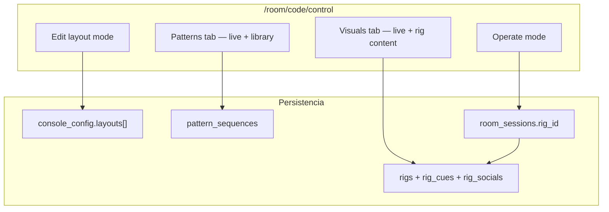

# Paradigma Layout — migración desde Account Rigs / Pattern Sequences

Plan de refactorización conceptual y técnica. Objetivo: unificar la configuración del operador en **`/room/[code]/control`** bajo el concepto de **Layout**, y retirar las vistas de cuenta que duplican o contradicen ese flujo.

UI siempre en inglés en producto; este documento está en español para alineación interna.

---

## 1. Resumen ejecutivo

### Paradigma antiguo (pre-Layout)

```
Cuenta (/rigs, /pattern-sequences)  →  pre-configurar todo offline
        ↓
Crear sala (/room/new)              →  elegir rig
        ↓
Control (/control)                  →  operar en vivo (consumir lo pre-configurado)
```

El operador **preparaba** el show en páginas de account y **ejecutaba** en control. La edición del desk (tabs, secciones, chrome del player) vivía repartida entre `/rigs` (tab Console, parcial) y el control (sin persistencia de layouts nombrados).

### Paradigma nuevo (Layout)

```
Control (/control)                  →  operar + editar Layout en contexto live
        │
        ├── Layout (persistido en rig.console_config)
        │     ├── Play Devices desk  (secciones, orden, player chrome)
        │     └── Visuals desk       (secciones, orden)
        │
        ├── Show content (persistido en rig + tablas relacionadas)
        │     palette, art, logo, cues, socials, QR/displayName…
        │
        └── Pattern library (persistido en pattern_sequences)
              secuencias reutilizables, editables y enviables live desde el desk
```

**Layout** = cómo se ve y se organiza el escritorio del operador (UI del console).  
**No es** el contenido del show ni las secuencias de patrones — eso sigue en otras capas, pero **se edita desde el mismo lugar** (control), no desde `/rigs` ni `/pattern-sequences`.

---

## 2. Tres capas de persistencia (modelo mental)

| Capa | Qué es | Dónde vive hoy | Editado desde (objetivo) |
|------|--------|----------------|--------------------------|
| **Session** | Sala live efímera | `room_sessions` (`room_code`, `rig_id`, matrix, devices…) | `/room/new`, runtime |
| **Show profile (Rig)** | Identidad y contenido del set | `rigs`, `rig_cues`, `rig_socials` | Control → Visuals / futuro “Show settings” |
| **Layout** | Desk del operador (Devices + Visuals UI) | `rigs.console_config.layouts[]` | Control → Edit layout |
| **Pattern library** | Presets de dispositivos reutilizables | `pattern_sequences` | Control → Play Devices tab |



---

## 3. Qué es un Layout (implementación actual)

Definido en `web/lib/glow/console-layouts.ts`:

```ts
type ConsoleLayout = {
  id: string;
  name: string;
  hiddenButtons: string[];      // secciones ocultas — Play Devices
  playSectionOrder: string[];   // orden — Play Devices
  playerChrome: PlayerChromeConfig;
  visualsHidden: string[];      // secciones ocultas — Visuals desk
  visualsOrder: string[];       // orden — Visuals desk
};
```

Persistencia en `rig.console_config`:

```json
{
  "layouts": [ { "...ConsoleLayout" } ],
  "activeLayoutId": "layout-uuid",
  "visibleTabs": ["devices", "visuals"],
  "hiddenButtons": ["..."],
  "playSectionOrder": ["..."],
  "playerChrome": { "..." },
  "displayName": "...",
  "displayNameConfig": { "position": "center" },
  "qrConfig": { "enabled": true, "intervalSeconds": 60, "durationSeconds": 10 },
  "logoConfig": { "position": "center", "effect": "none", "opacity": 0.8 }
}
```

**Espejo top-level:** el layout activo replica `hiddenButtons`, `playSectionOrder` y `playerChrome` al top-level de `console_config` para que `/play` y `GET /api/rooms/[code]/share-info` sigan funcionando sin conocer layouts.

**Solo en el objeto layout (no espejado):** `visualsHidden`, `visualsOrder` — solo los usa el desk del operador.

**Contenido del show (no es layout):** `displayName`, `qrConfig`, `logoConfig`, columnas `palette`, `default_visual_art_id`, `logo_*`, tablas `rig_cues` / `rig_socials`.

UI de gestión: `LayoutManager` en modo Edit (`web/components/glow/layout-manager.tsx`).

---

## 4. Superficies que pierden sentido

### 4.1 `/rigs` — Rigs Configuration

**Archivo:** `web/app/(account)/rigs/page.tsx` (~1976 líneas)

**Qué hace hoy:**

| Tab | Datos |
|-----|-------|
| Info | `name`, `palette`, `defaultVisualArtId`, logo upload, `logoEnabled`, `displayName`, `logoConfig`, `qrConfig` |
| Cues | `rig_cues` (lista ordenada de visual arts) |
| Socials | `rig_socials` |
| Console | `visibleTabs`, `playerChrome.showReactionsToolbar` |

**Enlaces:** `UserAccountMenu` → “My Rigs”, `/room/new` → “Rigs Manager”.

**Por qué choca con Layout:**

- El tab **Console** edita una fracción mínima de lo que ahora vive en Edit layout (solo reactions toolbar vs chrome completo, secciones, orden, múltiples layouts).
- Duplica conceptos que el operador ya configura **en vivo** desde control (Visuals tab: palette, art, logo; Edit mode: player chrome, secciones).
- **Riesgo crítico:** al guardar, construye `consoleConfig` **desde cero** sin preservar `layouts`, `hiddenButtons`, `playSectionOrder`, `visualsHidden`, `visualsOrder`:

```ts
// web/app/(account)/rigs/page.tsx — handleSave
consoleConfig: {
  visibleTabs: formConsoleTabs,
  displayName: formDisplayName,
  // … qrConfig, logoConfig, playerChrome parcial
  // ❌ NO incluye layouts[], activeLayoutId, hiddenButtons, playSectionOrder, visuals*
}
```

Un save desde account **puede borrar layouts** creados en control.

---

### 4.2 `/pattern-sequences` — Pattern Sequences

**Archivo:** `web/app/(account)/pattern-sequences/page.tsx` (158 líneas)

**Qué hace hoy:** biblioteca offline con sidebar, CRUD vía `PatternSequenceEditor` (`variant="default"`), sin envío live.

**Por qué choca:**

- El control tab **Play Devices** ya monta el mismo editor con `variant="control"`: carga biblioteca, save/overwrite, **Send live**, selector en header.
- El editor en control enlaza a `/pattern-sequences` para “sequence library” — remisión circular.
- Delete/rename “oficial” solo en account; en control es incompleto.

**Conclusión:** la biblioteca no necesita página dedicada; el desk es el lugar natural de edición **con contexto live**.

---

## 5. Qué conservar del modelo Rig (sin la página /rigs)

La tabla `rigs` **sigue siendo necesaria**. Lo que cambia es **dónde se edita**, no el almacenamiento.

| Dato | Tabla / campo | Hoy en /rigs | Objetivo en control |
|------|---------------|--------------|---------------------|
| Nombre del set | `rigs.name` | Info tab | Visuals → Rig / room setup |
| Palette | `rigs.palette` | Info + Visuals live | Visuals tab (overwrite rig) |
| Default visual art | `rigs.default_visual_art_id` | Info | Visuals tab |
| Logo asset (surface) | `rigs.logo_asset_path` | Info upload | Visuals tab |
| Logo enabled | `rigs.logo_enabled` | Info | Visuals tab |
| Logo placement (projection) | `console_config.logoConfig` | Info | Visuals → Show Name & Logo |
| Display name + position | `console_config.displayName*` | Info | Visuals → Show Name & Logo |
| QR overlay defaults | `console_config.qrConfig` | Info | Visuals → Live QR |
| Cue list | `rig_cues` | Cues tab | Visuals (cue advance ya live; **editor de lista pendiente**) |
| Social links | `rig_socials` | Socials tab | Share/QR flow o sección Visuals |
| Visible tabs | `console_config.visibleTabs` | Console tab | Layout settings o entitlements |
| Player chrome | `console_config.playerChrome` | Console parcial | Edit layout → Play Devices |
| Layouts nombrados | `console_config.layouts[]` | ❌ no existía | Edit layout → LayoutManager |
| Multi-rig CRUD | `rigs` rows | Grid /rigs | Simplificar o mover a `/room/new` + settings mínimos |

**Pattern sequences:** tabla `pattern_sequences` **sin FK a rigs**. Scope owner/team. Permanece; solo cambia la UI de edición.

---

## 6. Base de datos — ¿hace falta migración?

### 6.1 Veredicto corto

**No hace falta una migración de schema obligatoria** para adoptar el paradigma Layout. El JSONB `console_config` ya soporta `layouts[]` y el código hace fallback legacy.

**Sí hace falta** endurecer la **semántica de escritura** (API + merges) y corregir bugs de carga antes de retirar `/rigs`.

### 6.2 Estado actual del schema (Drizzle)

| Tabla | Migración | Rol |
|-------|-----------|-----|
| `rigs` | `0002_add_rigs.sql` | Show profile + `console_config` jsonb |
| `rig_cues` | `0002_add_rigs.sql` | Cue list |
| `rig_socials` | `0002_add_rigs.sql` | Social links |
| `pattern_sequences` | `0003`, `0005` | Pattern library |
| `room_sessions` | — | `rig_id` FK → rigs |

Campos jsonb relevantes en `console_config`:

- **Layout system:** `layouts[]`, `activeLayoutId`, `hiddenButtons`, `playSectionOrder`, `playerChrome`, `visualsHidden`, `visualsOrder` (estos dos últimos solo dentro de cada layout)
- **Show content (jsonb):** `displayName`, `displayNameConfig`, `qrConfig`, `logoConfig`
- **Desk visibility:** `visibleTabs` (`devices` \| `visuals` — legacy id; control mapea `devices` → tab `patterns`)

### 6.3 Opciones de evolución (fases posteriores, no bloqueantes)

| Opción | Cuándo considerarla | Esfuerzo |
|--------|---------------------|----------|
| **A — Solo JSONB (recomendado ahora)** | Layout ya funciona anidado en `console_config` | Bajo |
| **B — Tabla `rig_layouts`** | Muchos layouts por rig, queries, historial | Medio — migración + backfill |
| **C — Renombrar `rigs` → `shows`** | Cambio de lenguaje de producto | Alto — cosmético |
| **D — `schema_version` en console_config** | Validación estricta en API | Bajo — recomendable en Fase 1 |

**Recomendación:** Fase 1 con **Opción A + D**. Promover a tabla solo si aparecen requisitos de query (p.ej. “compartir layout entre rigs”).

### 6.4 Backfill de datos existentes

Script de migración de datos (no DDL):

1. Para cada rig con `console_config` legacy (sin `layouts[]`):
   - Crear layout `"Default"` desde `hiddenButtons`, `playSectionOrder`, `playerChrome`, `visualsHidden`, `visualsOrder` top-level si existen.
   - Set `activeLayoutId` = id del Default.
2. Normalizar `visibleTabs`: `devices` → mantener en DB; el parser en control ya mapea a `patterns`.
3. Verificar rigs guardados desde `/rigs` que hayan perdido layouts — restaurar desde backup si aplica.

Función existente: `parseConsoleLayouts()` ya sintetiza Default si falta array.

---

## 7. Bugs e inconsistencias a resolver ANTES de retirar account pages

### 7.1 Control carga rig incorrecto

```ts
// web/app/(control)/room/[code]/control/page.tsx — loadRig()
const rig = rigs.find((r) => r.is_default) ?? rigs[0];
// ❌ Ignora room_sessions.rig_id elegido en /room/new
```

**Fix:** cargar el rig de la sesión (`roomState.rigId` o equivalente del payload socket/API). Fallback a `is_default` solo si `rig_id` es null.

### 7.2 Account PATCH pisa layouts

**Fix (elegir una):**

- **API merge:** `PATCH /api/rigs/[id]` hace deep-merge de `consoleConfig` preservando claves no enviadas (`layouts`, `activeLayoutId`, …).
- **Cliente account:** spread `...editingRig.consoleConfig` antes de overwrite (parche mínimo hasta retirar página).
- **Definitivo:** eliminar `/rigs` y centralizar writes en control con funciones dedicadas por dominio.

### 7.3 VisualsTab PATCH parcial

`handleOverwriteRig()` envía solo `palette`, `defaultVisualArtId`, `logoEnabled` — **correcto** (no toca console_config). Mantener este patrón.

### 7.4 Tab id legacy

Account guarda `visibleTabs: ['devices', 'visuals']`. Control usa `ActiveTab = 'patterns' | 'visuals'`. Normalizar en un solo vocabulario (`patterns` | `visuals`) en persistencia cuando se haga cleanup.

---

## 8. Mapa de funcionalidad: dónde vive cada cosa (estado objetivo)

### Play Devices tab (Layout + Patterns)

| Feature | Estado hoy | Objetivo |
|---------|------------|----------|
| Layouts nombrados (save/switch/rename/delete) | ✅ Edit mode | Mantener |
| Hide/reorder secciones (sequences, torch, devices, matrix) | ✅ | Mantener |
| Player chrome completo (menu, flash, logo drag, layers) | ✅ Edit mode | Mantener |
| Pattern sequence library CRUD | ⚠️ Parcial (save/load/live; delete → account) | CRUD completo in-desk |
| Send live patterns | ✅ | Mantener |
| Share party join link | ✅ Header tab segment | Mantener |

### Visuals tab (Layout + Show content)

| Feature | Estado hoy | Objetivo |
|---------|------------|----------|
| Hide/reorder secciones desk | ✅ Edit mode | Mantener |
| Live preview + emit | ✅ | Mantener |
| Palette / art / logo live | ✅ | Mantener |
| Overwrite rig (palette, art, logo) | ✅ Sección Rig | Mantener / ampliar |
| displayName, qrConfig, logoConfig | ⚠️ Leídos del rig; editados solo en /rigs | Mover a secciones Visuals |
| Cue list editor | ❌ Solo en /rigs | Mover a Visuals o Edit |
| Socials editor | ❌ Solo en /rigs | Mover a share/QR o Visuals |
| Share projector link | ✅ Header tab segment | Mantener |
| Cue List desk section | Comentada / oculta | Decidir: restaurar o eliminar producto |

### Fuera del desk (pero necesario)

| Feature | Objetivo |
|---------|----------|
| Crear sala + elegir rig | `/room/new` (mantener selector; quitar link “Rigs Manager”) |
| Multi-rig: crear / eliminar / default | Flujo mínimo en `/room/new` o modal “Manage shows” — **no** página 2000 líneas |
| Plan limits (`max_rigs`, `max_pattern_sequences`) | Validación API sin cambiar schema |

---

## 9. Plan de migración por fases

### Fase 0 — Estabilizar (bloqueante)

- [ ] Fix: control carga `room_sessions.rig_id`
- [ ] Fix: API merge de `consoleConfig` o prohibir writes destructivos desde account
- [ ] Backfill layouts Default para rigs legacy (script one-shot)
- [ ] QA: guardar layout en control → editar rig en account → verificar layouts intactos

### Fase 1 — Paridad funcional en control

- [ ] Pattern sequences: delete, rename, sidebar/library **dentro** de Patterns tab (eliminar link a `/pattern-sequences`)
- [ ] Visuals: editar `displayName`, `qrConfig`, `logoConfig` desde desk (hoy solo /rigs)
- [ ] Visuals: editor de `rig_cues` (mínimo: reorder + add/remove art)
- [ ] Visuals o share: editor de `rig_socials` (plan-gated)
- [ ] `visibleTabs` editable en Edit layout o settings del rig
- [ ] Unificar `CollapsibleDeskCard` en secciones Visuals (consistencia UX)

### Fase 2 — Retirar account pages

- [ ] Eliminar `web/app/(account)/rigs/page.tsx`
- [ ] Eliminar `web/app/(account)/pattern-sequences/page.tsx`
- [ ] Quitar enlaces en `user-account-menu.tsx` (“My Rigs”, “Pattern Sequences”)
- [ ] Quitar “Rigs Manager” de `/room/new`
- [ ] Redirects: `/rigs` → `/room/new` o home; `/pattern-sequences` → docs/help o control si hay sesión activa
- [ ] Actualizar `docs/features/02-rigs.md`, `03-control-panel-tabs.md`

### Fase 3 — Simplificar modelo multi-rig (opcional)

- [ ] “Manage shows” compacto: lista, create, delete, set default (sin tabs duplicados)
- [ ] Evaluar `rig_layouts` table si layouts > ~10 por rig o necesidad de compartir
- [ ] Normalizar `visibleTabs` vocabulary en DB
- [ ] Incrementar `console_config.schema_version` con validador Zod en API

---

## 10. Cambios de API recomendados

### PATCH `/api/rigs/[id]` — merge seguro

```ts
// Pseudocódigo — preserve layout keys when partial patch
if (body.consoleConfig !== undefined) {
  const existing = rig.consoleConfig as Record<string, unknown>;
  const merged = {
    ...existing,
    ...body.consoleConfig,
    // Never drop layouts unless explicitly sent
    layouts: body.consoleConfig.layouts ?? existing.layouts,
    activeLayoutId: body.consoleConfig.activeLayoutId ?? existing.activeLayoutId,
  };
}
```

Alternativa más estricta: endpoints separados:

- `PATCH /api/rigs/[id]/show` — palette, art, logo, displayName, qr, logoConfig
- `PATCH /api/rigs/[id]/layouts` — solo layouts array + activeLayoutId
- `PUT /api/rigs/[id]/cues`, `PUT /api/rigs/[id]/socials` — ya existen

### Pattern sequences

Sin cambio de schema. Opcional: endpoint de listado ligero para sidebar en control (ya usa `GET /api/pattern-sequences`).

---

## 11. Navegación objetivo

| Antes | Después |
|-------|---------|
| Account menu → My Rigs | ❌ Eliminado |
| Account menu → Pattern Sequences | ❌ Eliminado |
| /room/new → Rigs Manager | ❌ Eliminado; selector inline suficiente |
| Control → Edit layout | ✅ Punto único de configuración del desk |
| Control → Patterns tab | ✅ Biblioteca + live |
| Control → Visuals tab | ✅ Show content + live |

Menú account residual sugerido: Billing, Create room, Home, (futuro) Manage shows compacto.

---

## 12. Relación con docs existentes

| Documento | Acción |
|-----------|--------|
| `docs/features/02-rigs.md` | Actualizar: rig = show profile; layout ≠ rig; editors movidos a control |
| `docs/features/03-control-panel-tabs.md` | Actualizar: cue/social editors ya no en Rigs Manager |
| `docs/improvements/visuals-tab-redesign-plan.md` | Completado (T1–T7); referenciar este doc para fase account retirement |
| `docs/architecture.md` §6 | Añadir subsección Layout vs Show profile |

---

## 13. Decisiones abiertas

1. **¿Un rig por team en Free y multi-rig solo Pro?** Afecta si necesitamos UI multi-rig post-/rigs.
2. **¿Cue List vuelve al desk Visuals?** Está comentada en `VISUALS_SECTIONS`; alinear con producto.
3. **¿Layouts compartibles entre rigs?** Si sí → tabla `rig_layouts` o templates.
4. **¿Pattern sequences ligadas a un layout?** Hoy son globales del owner; podría haber “default sequence per layout”.
5. **¿Renombrar “Rig” → “Show” en UI?** Solo copy; schema puede quedar `rigs`.

---

## 14. Checklist de aceptación del paradigma

- [ ] Operador puede configurar desk completo (Devices + Visuals) sin visitar `/rigs`
- [ ] Operador puede CRUD pattern sequences sin visitar `/pattern-sequences`
- [ ] Operador puede editar show content (palette, cues, socials, QR, display name) desde control
- [ ] Guardar layout nunca pierde show content; guardar show content nunca pierde layouts
- [ ] Sala live usa el rig elegido en `/room/new`, no solo `is_default`
- [ ] No quedan enlaces rotos a páginas eliminadas
- [ ] `pnpm exec tsc --noEmit` + QA regresión control/play/visuals surface

---

## 15. Archivos clave de referencia

| Área | Path |
|------|------|
| Layout types | `web/lib/glow/console-layouts.ts` |
| Control orchestration | `web/app/(control)/room/[code]/control/page.tsx` |
| Layout UI | `web/components/glow/layout-manager.tsx` |
| Edit section chrome | `web/components/glow/edit-section-chrome.tsx` |
| Play desk | `web/components/glow/play-devices-desk.tsx` |
| Visuals desk | `web/components/glow/visuals-tab.tsx` |
| Pattern editor | `web/components/glow/pattern-sequence-editor.tsx` |
| Account rigs (retirar) | `web/app/(account)/rigs/page.tsx` |
| Account sequences (retirar) | `web/app/(account)/pattern-sequences/page.tsx` |
| Schema | `web/lib/db/schema.ts` |
| Feature spec rigs | `docs/features/02-rigs.md` |
