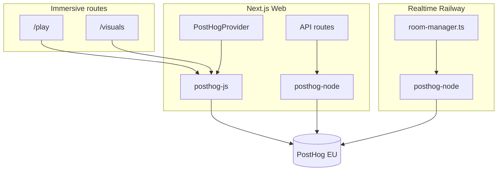

# PostHog — Production Analytics & Error Tracking

**Status:** planning · **Gate:** required before public production release  
**Related:** [Last-sprint-for-release.md](./Last-sprint-for-release.md), [plans-marketing-strategy.md](./plans-marketing-strategy.md) §17, [deployment.md](./deployment.md)

---

## Summary

Integrate [PostHog](https://posthog.com) across the Glow stack to answer three questions in production:

1. **Product:** Are users creating rooms, joining, upgrading plans, and using Stage vs Floor features?
2. **Reliability:** Where do client and server errors happen (WebRTC, socket, visuals, Stripe)?
3. **Growth:** Do Free → Party → Venue conversion funnels and Glow branding touchpoints work?

Glow has **three client surfaces** and **one server** to instrument:

| Surface | Auth | Package |
| --- | --- | --- |
| Next.js web (orchestrator, billing, marketing) | Supabase OAuth | `posthog-js` + `posthog-node` |
| Immersive routes (`/play`, `/visuals`) | Anonymous players / token | `posthog-js` (anonymous) |
| Realtime service (Railway) | N/A | `posthog-node` |

No analytics provider exists in the repo today. This doc is the implementation spec.

---

## Goals (release)

| Goal | PostHog capability |
| --- | --- |
| Funnel & plan conversion | Events + funnels + optional group analytics (`team_id`) |
| Upgrade modal effectiveness | Custom events from future `PlanGate` |
| Room / device scale observability | Server + client events with `device_count`, `plan_code` |
| Error monitoring | `$exception` / `captureException` on web + realtime |
| Feature rollout | Feature flags (PlanGate, raffle, polls) |
| Session debugging (orchestrator only) | Session replay — **off for `/play` by default** (privacy) |
| EU data residency | PostHog EU cloud project (recommended for EU users) |

---

## Non-goals (v1)

- Full APM / distributed tracing (PostHog is not OpenTelemetry)
- Player nickname or PII in event properties
- Session replay on anonymous player fullscreen routes
- Marketing site heatmaps (can add later)

---

## Privacy & compliance

Glow serves **anonymous players** (no account) and **authenticated orchestrators** (Supabase).

| Rule | Implementation |
| --- | --- |
| Player identity | Anonymous `distinct_id` (PostHog cookie or generated UUID in `sessionStorage`). Never send nickname. |
| Orchestrator identity | `posthog.identify(supabaseUserId)` with `{ team_id, plan_code }` only — no email in properties unless explicitly approved. |
| Room codes | Allowed as event properties (`room_code` is short-lived, not PII). |
| IP / geo | Rely on PostHog project settings; enable EU hosting. |
| Cookie consent | If EU launch requires it, gate init behind consent banner (Phase 5). |
| Opt-out | Respect `localStorage` / team setting for orchestrators; players always anonymous minimal. |

Document the privacy note in Terms / Privacy policy before enabling session replay.

---

## Environment variables

### Web (`web/.env.example`)

```env
# PostHog — client (public)
NEXT_PUBLIC_POSTHOG_KEY=phc_...
NEXT_POSTHOG_HOST=https://eu.i.posthog.com

# PostHog — server (API routes, optional server capture)
POSTHOG_API_KEY=phx_...          # same project personal API key or project key for server
POSTHOG_HOST=https://eu.i.posthog.com

# Kill switch (local dev default: off)
NEXT_PUBLIC_POSTHOG_ENABLED=false
```

### Realtime (`realtime/.env.example`)

```env
POSTHOG_API_KEY=phx_...
POSTHOG_HOST=https://eu.i.posthog.com
POSTHOG_ENABLED=false
```

**Local dev:** keep `*_ENABLED=false` so dev noise does not pollute production project. Use a separate PostHog **dev project** when testing integration.

---

## Architecture



### Optional: reverse proxy (ad-blocker bypass)

Add Next.js rewrite so the client sends to same origin:

```txt
/api/ph/* → https://eu.i.posthog.com/*
```

Set `api_host: '/api/ph'` in `posthog-js` init. Reduces blocked events in production.

---

## Shared library layout

```
web/lib/analytics/
  posthog-client.ts    # init, isEnabled, getPostHog()
  posthog-server.ts    # singleton posthog-node for API routes
  events.ts            # event name constants + typed payloads
  identify.ts          # orchestrator identify + group(team)
  capture-error.ts     # normalize Error → $exception
  use-track.ts         # optional React hook wrapper
```

```
realtime/src/analytics/
  posthog.ts           # posthog-node singleton
  events.ts            # mirror server-side event names
```

**Convention:** event names are `snake_case` with domain prefix:

- `room_created`, `room_joined`, `device_connected`
- `billing_upgrade_modal_shown`, `billing_checkout_started`
- `visuals_mode_set`, `webrtc_call_started`
- `realtime_socket_error`

---

## Event catalog

### Acquisition & auth

| Event | Where | Properties |
| --- | --- | --- |
| `page_view` | automatic (PostHog) | `$pathname`, `$referrer` |
| `sign_in_started` | `/auth/signin` | `provider` |
| `sign_in_completed` | auth callback | `provider`, `is_new_user` |

### Room lifecycle (core product)

| Event | Where | Properties |
| --- | --- | --- |
| `room_create_started` | `/room/new` | `plan_code`, `matrix_rows`, `matrix_cols` |
| `room_created` | after realtime ACK | `room_code`, `plan_code`, `matrix_cells`, `max_devices` |
| `room_create_failed` | error path | `reason`, `plan_code` |
| `room_join_started` | `/join` | — |
| `room_joined` | player join ACK | `room_code`, `role: player \| orchestrator \| visuals` |
| `room_closed` | desk or timeout | `room_code`, `duration_minutes`, `peak_device_count` |
| `device_connected` | server | `room_code`, `device_count`, `plan_code` |
| `device_disconnected` | server | `room_code`, `device_count` |

### Stage (visuals surface)

| Event | Where | Properties |
| --- | --- | --- |
| `visuals_surface_opened` | `/visuals` subscribed | `room_code`, `art_id`, `mode` |
| `visuals_mode_set` | desk | `room_code`, `mode`, `plan_code` |
| `visuals_art_changed` | desk | `room_code`, `art_id` |
| `visuals_token_error` | surface | `reason: missing \| expired \| invalid` |

### Floor (devices / presets)

| Event | Where | Properties |
| --- | --- | --- |
| `preset_run` | desk | `room_code`, `preset_id` |
| `pattern_sequence_run` | desk | `room_code`, `effect_count`, `has_layering` |
| `media_broadcast` | desk | `room_code`, `kind: image \| text \| gif` |
| `torch_toggled` | desk | `room_code`, `mode: pulse \| strobe` |

### Monetization (ties to [plans-marketing-strategy.md](./plans-marketing-strategy.md))

| Event | Where | Properties |
| --- | --- | --- |
| `billing_page_viewed` | `/billing` | `current_plan_code` |
| `billing_upgrade_modal_shown` | `PlanGate` | `feature`, `required_plan`, `trigger` |
| `billing_upgrade_modal_dismissed` | `PlanGate` | `feature`, `required_plan` |
| `billing_checkout_started` | checkout action | `target_plan_code`, `source: billing \| modal` |
| `billing_checkout_completed` | Stripe webhook / success | `plan_code`, `previous_plan_code` |
| `billing_portal_opened` | portal action | `current_plan_code` |
| `plan_limit_hit` | server or client | `limit_key`, `plan_code`, `room_code` |

### WebRTC & reliability

| Event | Where | Properties |
| --- | --- | --- |
| `webrtc_publisher_started` | player desk | `room_code` |
| `webrtc_publisher_failed` | player | `room_code`, `reason` |
| `webrtc_ice_failed` | player | `room_code`, `using_turn` |
| `socket_connected` | client | `surface: control \| play \| visuals` |
| `socket_disconnected` | client | `surface`, `reason` |
| `socket_reconnected` | client | `surface`, `downtime_ms` |

### Errors (automatic + manual)

| Event | Where | Properties |
| --- | --- | --- |
| `$exception` | client + server | `$exception_message`, `$exception_type`, `$exception_stack_trace`, `surface`, `room_code?` |

---

## Error tracking strategy

PostHog captures errors via `$exception` (Error Tracking product). Glow should wire:

### Client (web)

1. **`PostHogProvider`** with defaults:
   - `capture_exceptions: true` (PostHog JS SDK v1.100+)
2. **React Error Boundary** at root + control desk:
   - `captureException(error, { componentStack })`
3. **`window.onunhandledrejection`** — fallback if SDK misses promise rejections
4. **Immersive routes** — same boundary; tag `surface: play | visuals`

### Server (Next.js API routes)

Wrap critical handlers (Stripe webhook, room media upload, Klipy proxy):

```ts
try {
  // ...
} catch (error) {
  captureServerException(error, { route: '/api/stripe/webhook' });
  throw error;
}
```

### Realtime (Railway)

- Global `process.on('unhandledRejection')` / `uncaughtException` → PostHog + log
- Socket middleware catch-all for handler throws
- Structured capture on entitlement rejections (`plan_limit_hit`) — not exceptions, but events

### Error context properties (always include when available)

```ts
{
  surface: 'control' | 'play' | 'visuals' | 'billing' | 'realtime',
  room_code?: string,
  plan_code?: string,
  team_id?: string,
  app_version: process.env.VERCEL_GIT_COMMIT_SHA ?? 'local',
}
```

### Alerting (PostHog dashboard)

Create insights / alerts for:

- `$exception` count > threshold / 15 min
- `room_create_failed` spike
- `webrtc_ice_failed` rate vs `webrtc_publisher_started`
- `visuals_token_error` spike

---

## User & group identification

### Orchestrator (authenticated)

After Supabase session is available (layout or middleware client hook):

```ts
posthog.identify(user.id, {
  team_id: team.id,
  plan_code: team.plan.code,
});
posthog.group('team', team.id, {
  plan_code: team.plan.code,
  subscription_status: team.subscriptionStatus,
});
```

Refresh `plan_code` on Stripe webhook plan change.

### Player (anonymous)

- Let PostHog assign `distinct_id` (cookie)
- On join: `posthog.register({ room_code, role: 'player' })` — super properties for session
- On leave: `posthog.unregister('room_code')`
- **Do not** `identify()` with nickname

### Visuals surface (token auth)

- Anonymous distinct_id
- Properties: `role: 'visuals'`, `room_code`

---

## Feature flags (recommended)

Use PostHog flags for gradual rollout without redeploy:

| Flag key | Purpose |
| --- | --- |
| `plan_gate_modal` | Enable upgrade modal vs legacy overlay |
| `raffle_mode` | Raffle feature |
| `live_polls` | Poll production mode |
| `posthog_session_replay` | Orchestrator replay only |
| `gif_featured_only_free` | Depth limit enforcement |

Pattern:

```ts
if (posthog.isFeatureEnabled('raffle_mode')) { ... }
```

Server-side flags for realtime gates use `posthog-node` `getFeatureFlag()` with `distinctId = ownerUserId`.

---

## Session replay

**Default: disabled globally**, enable selectively:

| Route | Replay |
| --- | --- |
| `/billing`, `/room/new`, `/room/*/control` | ✅ if flag on |
| `/room/*/play`, `/room/*/visuals` | ❌ (fullscreen UX + anonymous) |
| `/join` | ❌ |

Configure in PostHog project settings + `session_recording: { maskAllInputs: true }` on orchestrator routes.

---

## Dashboards & funnels (post-launch)

Create in PostHog UI — definitions here so implementation matches [plans-marketing-strategy.md](./plans-marketing-strategy.md) §17:

### Funnel: Activation

`sign_in_completed` → `room_created` → `device_connected` (device_count ≥ 2)

### Funnel: Monetization

`plan_limit_hit` → `billing_upgrade_modal_shown` → `billing_checkout_started` → `billing_checkout_completed`

### Funnel: Upgrade path

`room_created` (plan=free) → `billing_checkout_completed` (plan=plus_25) within 24 h

### Insight: Scale

Weekly avg `peak_device_count` by `plan_code` — validates tier sizing.

### Insight: Stage vs Floor

Compare `visuals_mode_set` vs `preset_run` per active room — product mix.

---

## Implementation phases

### Phase 1 — Project setup & env

- [ ] Create PostHog project (EU region)
- [ ] Add env vars to `web/.env.example`, `realtime/.env.example`, Vercel, Railway
- [ ] Document in [deployment.md](./deployment.md) env table
- [ ] Add `NEXT_PUBLIC_POSTHOG_ENABLED=false` default for local

### Phase 2 — Web client bootstrap

- [ ] Install `posthog-js` in `web/`
- [ ] Add `web/lib/analytics/*` helpers
- [ ] Create `web/components/analytics/posthog-provider.tsx` (`'use client'`)
- [ ] Wrap root layout children with provider (inside `ThemeProvider`)
- [ ] Pageview capture on App Router navigations (`usePathname` + `posthog.capture('$pageview')`)
- [ ] Optional: `/api/ph/[...path]` reverse proxy rewrite in `next.config.ts`

### Phase 3 — Identify orchestrators

- [ ] `usePostHogIdentify()` hook — runs when `/api/user` + `/api/team` available
- [ ] Update traits on billing return / plan webhook (server-side `posthog-node` identify)

### Phase 4 — Core product events

- [ ] Instrument `/room/new` — create started / created / failed
- [ ] Instrument `/join` + play page — join started / joined
- [ ] Instrument control desk — preset, visuals mode, media (thin wrappers, no spam: debounce rapid fires)
- [ ] Instrument billing page + checkout actions

### Phase 5 — Error tracking

- [ ] Enable `capture_exceptions` in PostHog init
- [ ] Add `web/components/analytics/error-boundary.tsx`
- [ ] Add `web/lib/analytics/capture-error.ts` for API routes
- [ ] Wire Stripe webhook + media API error capture

### Phase 6 — Realtime server

- [ ] Install `posthog-node` in `realtime/`
- [ ] Singleton + flush on shutdown
- [ ] Events: `device_connected`, `device_disconnected`, `room_closed`, `plan_limit_hit`
- [ ] Global unhandled error handlers

### Phase 7 — Feature flags & replay

- [ ] Define flags in PostHog UI
- [ ] Wire `plan_gate_modal` stub for future PlanGate
- [ ] Session replay flag — orchestrator routes only

### Phase 8 — QA & production gate

- [ ] Dev project smoke test (events appear in Live Events)
- [ ] Staging / preview deploy with `POSTHOG_ENABLED=true`
- [ ] Verify no events when disabled
- [ ] Verify player routes do not call `identify` with PII
- [ ] Add row to [Last-sprint-for-release.md](./Last-sprint-for-release.md) checklist
- [ ] Add step to [deployment.md](./deployment.md) § production checklist

---

## Files to touch

| Path | Change |
| --- | --- |
| `web/package.json` | `posthog-js` |
| `realtime/package.json` | `posthog-node` |
| `web/.env.example` | PostHog vars |
| `realtime/.env.example` | PostHog vars |
| `web/next.config.ts` | optional rewrite `/api/ph` |
| `web/app/layout.tsx` | `PostHogProvider` |
| `web/lib/analytics/*` | new module |
| `web/components/analytics/posthog-provider.tsx` | new |
| `web/components/analytics/error-boundary.tsx` | new |
| `web/app/(control)/room/new/page.tsx` | room events |
| `web/app/(join)/**` | join events |
| `web/app/(control)/room/[code]/control/page.tsx` | identify + key actions |
| `web/app/(immersive)/room/[code]/play/page.tsx` | anonymous join event |
| `web/app/(immersive)/room/[code]/visuals/page.tsx` | surface opened + token errors |
| `web/app/(account)/billing/page.tsx` | billing page view |
| `web/lib/payments/actions.ts` | checkout started |
| `web/app/api/stripe/webhook/route.ts` | checkout completed + identify update |
| `realtime/src/room-manager.ts` | device + limit events |
| `realtime/src/index.ts` | shutdown flush, global errors |
| `docs/deployment.md` | env + checklist |
| `docs/Last-sprint-for-release.md` | release gate reference |

---

## Acceptance criteria

1. With `POSTHOG_ENABLED=true` in staging, `room_created` and `device_connected` appear in PostHog Live Events within 30 s.
2. Orchestrator sessions show `identify` with `team_id` and `plan_code`; players remain anonymous.
3. Thrown error in control desk appears as `$exception` with `surface: control`.
4. Realtime unhandled rejection appears as `$exception` with `surface: realtime`.
5. With `POSTHOG_ENABLED=false` (local default), zero network calls to PostHog hosts.
6. Session replay does not record `/play` or `/visuals` routes.
7. Funnel “Activation” can be built in PostHog UI from documented events alone.
8. Production deployment checklist in `deployment.md` includes PostHog env vars.

---

## Open questions

1. **Single PostHog project** for web + realtime, or separate “Realtime” project?
   - Recommend: **one project**, use `surface` property to filter.
2. **Cookie consent banner** before first launch in EU?
   - Legal review; Phase 5 stub if required.
3. **PostHog vs Sentry** for errors — PostHog only for v1, or add Sentry later for stack traces?
   - Recommend: PostHog `$exception` for release; revisit if depth insufficient.
4. **Event volume budget** — sample high-frequency events (`preset_run`) at 10%?
   - Enable if bill exceeds free tier; use `$sample_rate` property.
5. **Server-side only analytics** for players with strict cookie blockers?
   - Optional: realtime forwards aggregate join events (already planned in Phase 6).

---

## References

- PostHog Next.js App Router guide: https://posthog.com/docs/libraries/next-js
- PostHog Error Tracking: https://posthog.com/docs/error-tracking
- PostHog Feature Flags: https://posthog.com/docs/feature-flags
- PostHog Group Analytics: https://posthog.com/docs/product-analytics/group-analytics
- Glow success metrics: [plans-marketing-strategy.md](./plans-marketing-strategy.md) §17
