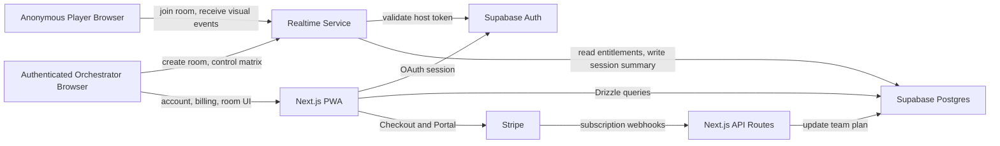
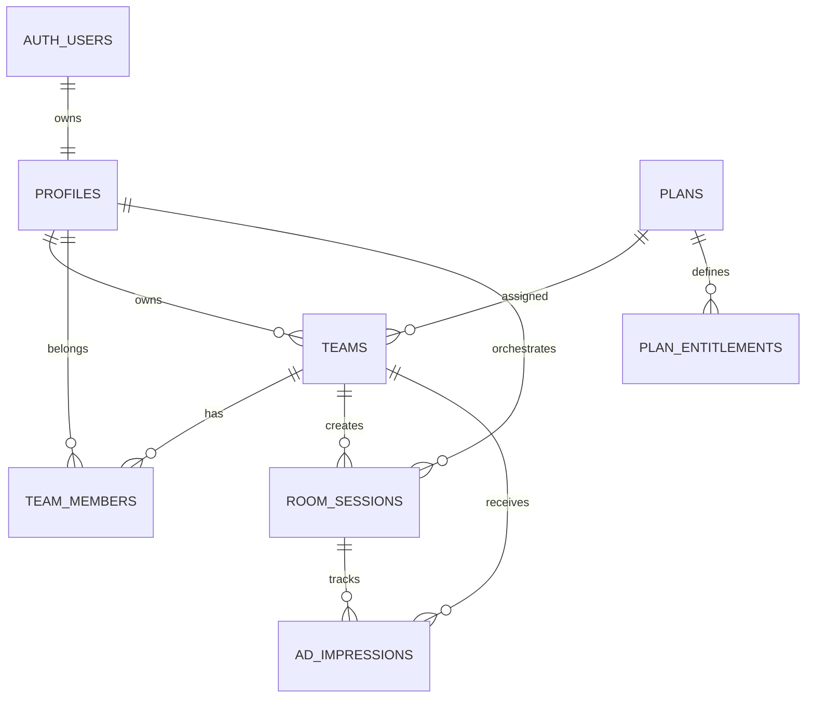

# Glow Product Intent

## Purpose

Glow is a lightweight multi-device visual synchronization app.

The product lets one authenticated user create a room and orchestrate colors, light effects, and matrix-based visual patterns across many anonymous player devices. Player devices can be phones, tablets, smartwatches, browsers, or future native shells built with Capacitor.

The first milestone is not a polished design system. The first milestone is proving that the core idea works:

- A host can create a room.
- Anonymous devices can join with a short room code.
- The host can see who is connected.
- The host can assign and adjust each device position inside a matrix.
- The host can trigger colors and effects that appear on the correct devices.
- The system still works when the matrix has empty cells.
- Free rooms show mock ads.
- Paid rooms do not show ads.

The product should feel like a simple digital lighting desk for a crowd.

## Product Vision

Glow follows an orchestrator-player model.

- The **orchestrator** creates and controls a room.
- The **players** join the room anonymously and become pixels, panels, or light sources.
- The **matrix** gives physical meaning to each player device by mapping it to a row and column.
- The **control panel** gives the orchestrator live feedback and direct control, similar to a compact lighting console.

The long-term vision is a web-first, portable visual engine that can later be wrapped as native iOS and Android apps without changing the core logic.

> **v2 expansion:** the orchestrator/player/matrix/control-panel model below is the v1
> foundation. The second wave of features (a dedicated **Visuals projection surface**,
> **rigs** (saved DJ setups), a **two-tab control desk**, **audience reactions**, **orchestrator
> media broadcasting**, **layered presets**, **device flash control**, and a **WebRTC
> live-call mosaic**) is specified in [architecture.md](./architecture.md),
> [plans.md](./plans.md), and the numbered specs in
> [features/](./features/00-feature-index.md). The control panel referenced here
> becomes the **Devices** tab; a new **Visuals** tab controls the projection surface.

## MVP Scope

The MVP should focus on real synchronization and physical feedback, not visual polish.

Included in MVP:

- Supabase OAuth for authenticated orchestrators.
- Anonymous player joining.
- Room code join flow.
- Realtime room server separate from Next.js.
- Matrix mode with sparse cells.
- Device labels such as `A1`, `A25`, or `B4`.
- Orchestrator matrix panel.
- Device list with live connection state.
- Manual color pad.
- Basic presets.
- Manual high-latency fallback mode.
- Mock ads for free rooms.
- Stripe-backed paid plans.
- Plan entitlements stored in the database.
- PWA basics.

Not included in MVP:

- Native iOS/Android apps.
- Production ad provider integration.
- Fully automatic latency fallback.
- Persisting every color event.
- Full design system.
- Complex audio-reactive effects across all devices.
- Horizontal realtime scaling with Redis.

## Current Boilerplate Reality

The current app is a generic SaaS starter.

Useful parts:

- Next.js App Router.
- React.
- Tailwind CSS.
- shadcn/ui components.
- Stripe integration.
- Drizzle/Postgres setup.
- Supabase packages already present.

Parts to replace or remove:

- Password-based auth.
- Custom JWT session cookie.
- `users.password_hash`.
- Generic SaaS landing copy.
- Team invitation UI.
- Team settings as the main dashboard.
- Base/Plus pricing.
- Password security page.

The app should move from “SaaS boilerplate with GLOW branding” to “Glow the rave control system”.

## Core User Modes

### Create Room

The orchestrator signs in with Supabase OAuth and creates a room.

The create room flow should allow:

- Choosing matrix size.
- Seeing current plan limits.
- Creating a default matrix room.
- Showing a mock ad before creation if the team is on the free plan.
- Opening the orchestrator control panel after the room is created.

### Join Room

Players do not sign in.

The join flow should allow:

- Entering a 4-6 character room code.
- Entering an optional nickname.
- Choosing an initial matrix position.
- Seeing a mock ad before joining if the room was created by a free team.
- Entering a fullscreen player surface.

### Standalone

Standalone mode is local and does not require a room.

It should allow:

- Running basic presets locally.
- Testing the visual renderer.
- Later using local microphone input.

Standalone is useful both as a product feature and as a technical test harness.

## Screens

### Landing

Route: `/`

Purpose:

- Explain Glow in one sentence.
- Provide direct actions.

Primary actions:

- Create room.
- Join room.
- Standalone mode.

The landing should replace all SaaS starter messaging.

### Sign In

Route: `/sign-in`

Purpose:

- Let orchestrators sign in with Supabase OAuth.

Rules:

- No password login.
- No password signup.
- Start with Google OAuth.
- Leave room for other Supabase-supported OAuth providers.

### Create Room

Route: `/room/new`

Purpose:

- Configure and create a new orchestrated room.

Controls:

- Matrix rows.
- Matrix columns.
- Plan limit summary.
- Create button.

Free plan behavior:

- Show mock ad before room creation.

### Orchestrator Control

Route: `/room/[code]/control`

Purpose:

- Main live control desk.

Sections:

- Room header with code and room status.
- Device list.
- Matrix panel.
- Color pad.
- Preset selector.
- Fallback mode switch.
- Session controls.

The orchestrator should be able to:

- See connected devices.
- See device labels.
- See latency/state per device.
- Identify a physical device.
- Reassign a device position.
- Click one matrix cell and light that device.
- Trigger presets across the matrix.
- Toggle manual fallback mode.
- Close the room.

### Join

Route: `/join`

Purpose:

- Let anonymous players enter a room.

Inputs:

- Room code.
- Optional nickname.

After validating the room:

- Show mock ad if room has ads enabled.
- Continue to the player route.

### Player

Route: `/room/[code]/play`

Purpose:

- Turn the device screen into a light surface.

Features:

- Fullscreen visual surface.
- Connection status.
- Initial position picker.
- Large device label display.
- Identify flash.
- Color and preset rendering.
- Best-effort wake lock.
- Fullscreen button.

The player should keep working even if it has not yet been assigned to a matrix cell.

### Standalone

Route: `/standalone`

Purpose:

- Local visual mode without rooms.

Features:

- Preset list.
- Color preview.
- Later microphone visualizer.

### Billing

Route: `/billing` or `/pricing`

Purpose:

- Show real Glow plans.
- Start Stripe Checkout for paid plans.
- Open Stripe Customer Portal for existing paid teams.

Plans:

- Free.
- Plus 25.
- Plus 50.
- Pro.

## Architecture Overview



## Service Responsibilities

### Next.js PWA

The web app owns UI, auth flows, billing flows, and browser-side visual rendering.

Responsibilities:

- Landing.
- OAuth sign-in.
- Account and billing screens.
- Create room flow.
- Join room flow.
- Orchestrator control UI.
- Player fullscreen UI.
- Standalone UI.
- Socket.io client.
- PWA metadata and manifest.

It should not:

- Store active room state.
- Own WebSocket room memory.
- Require auth for players.
- Persist high-frequency visual events.

### Realtime Service

The realtime service is a separate long-running Node.js process.

Responsibilities:

- Socket.io server.
- Room creation.
- Anonymous player join.
- Matrix state.
- Device state.
- Latency tracking.
- Plan limit enforcement.
- Broadcast visual instructions.
- Cleanup inactive rooms.
- Persist room session summaries.

Good deployment targets:

- Railway.
- Fly.io.
- Render.
- Google Cloud Run.
- VPS.

Next.js on Vercel should not host the Socket.io server because Vercel Functions are not designed for long-lived in-memory WebSocket rooms.

### Supabase

Supabase owns identity and product state.

Responsibilities:

- OAuth authentication.
- User profiles.
- Teams.
- Plans.
- Entitlements.
- Historical room sessions.
- Ad impressions.

Supabase Realtime may be useful later for auxiliary dashboards or low-frequency updates, but it should not be the authoritative room engine for the MVP.

### Stripe

Stripe owns payment processing.

Responsibilities:

- Checkout.
- Customer Portal.
- Subscription lifecycle.
- Webhooks.

Stripe does not define product behavior. Product behavior comes from `plans` and `plan_entitlements` in Postgres.

## Database Architecture



### `profiles`

Represents a Supabase Auth user.

Important fields:

- `id`
- `email`
- `full_name`
- `avatar_url`
- `created_at`
- `updated_at`

Rules:

- `id` references `auth.users.id`.
- No password fields.
- One profile per authenticated orchestrator.

### `teams`

Represents the billing and orchestration account.

Important fields:

- `id`
- `name`
- `owner_user_id`
- `stripe_customer_id`
- `stripe_subscription_id`
- `stripe_product_id`
- `stripe_price_id`
- `plan_id`
- `subscription_status`
- `created_at`
- `updated_at`

Rules:

- MVP creates one default team per user.
- Subscription lives on the team.
- The team plan determines room limits and ads.

### `team_members`

Keeps the model future-proof for shared teams.

Important fields:

- `id`
- `team_id`
- `user_id`
- `role`
- `created_at`

Rules:

- MVP only needs owner membership.
- Team invite UI is not part of MVP.

### `plans`

Internal product catalog.

Important fields:

- `id`
- `code`
- `name`
- `description`
- `stripe_product_id`
- `stripe_price_id`
- `monthly_price_cents`
- `currency`
- `is_active`
- `sort_order`

Initial plans:

- `free`
- `plus_25`
- `plus_50`
- `pro`

Rules:

- Free has no Stripe price.
- Paid plans map to Stripe prices.
- Plan codes should be stable.

### `plan_entitlements`

Defines what each plan unlocks.

Important fields:

- `id`
- `plan_id`
- `key`
- `value_json`

Initial entitlement keys:

- `max_devices`
- `ads_enabled`
- `available_presets`
- `audio_reactive`
- `matrix_mode`
- `advanced_matrix`
- `custom_grid_size`
- `max_grid_rows`
- `max_grid_cols`
- `max_room_duration_minutes`
- `manual_fallback_mode`
- `priority_reconnect_window_seconds`

Rules:

- The database stores flexible `key + value_json` rows.
- Server code converts them into a typed entitlement object.
- Missing keys must fall back to safe defaults.

### `room_sessions`

Historical summary of rooms.

Important fields:

- `id`
- `room_code`
- `team_id`
- `orchestrator_user_id`
- `plan_id`
- `plan_code_snapshot`
- `entitlements_snapshot`
- `matrix_rows`
- `matrix_cols`
- `started_at`
- `ended_at`
- `close_reason`
- `peak_devices`
- `total_joined_devices`
- `ads_enabled_snapshot`

Rules:

- Does not represent active room state.
- Does not store visual events.
- Created when the room is created.
- Updated when the room closes.

### `ad_impressions`

Tracks mock ads now and real ad impressions later.

Important fields:

- `id`
- `room_session_id`
- `team_id`
- `viewer_type`
- `placement`
- `provider`
- `provider_impression_id`
- `shown_at`
- `metadata`

Expected values:

- `viewer_type`: `orchestrator`, `player`
- `placement`: `room_create`, `room_join`
- `provider`: `mock`

## Matrix Mode

Matrix mode maps devices to physical positions.

The matrix must be sparse.

That means:

- A matrix can be `3x3`, `10x10`, `25x25`, or custom within plan limits.
- A matrix does not need every cell occupied.
- A cell can be empty.
- A device can be connected without a position.
- A device can move from one cell to another.
- Effects are calculated by coordinate, not by device index.

Example:

```txt
A1 occupied
A2 empty
A3 occupied
B1 empty
B2 occupied
B3 empty
```

If an effect draws a wave across row A, only occupied cells receive visual commands. Empty cells are skipped.

## Device Labels

Labels connect software state with physical reality.

Examples:

- `A1`
- `A25`
- `B4`

Rules:

- The label is derived from row and column.
- The player should show its label clearly.
- The orchestrator can trigger identify mode.
- Identify mode should flash the screen and show the label large.
- If the orchestrator changes a position, the player receives the updated label.

This is critical for physically arranging phones into a real-world grid.

## Orchestrator Feedback

The orchestrator control panel must show live room state.

Device list should show:

- Nickname.
- Device label.
- Position.
- Latency.
- Online/stale/reconnecting status.
- Identify action.
- Reassign action.

Matrix panel should show:

- Grid rows and columns.
- Empty cells.
- Occupied cells.
- Selected cell.
- Device status per occupied cell.
- Click-to-light behavior.

The control panel should feel playful and direct, like a small lighting desk.

## Realtime Room State

The realtime server keeps active state in memory.

Conceptual structure:

```ts
type RoomState = {
  code: string;
  sessionId: string;
  teamId: string;
  orchestratorUserId: string;
  orchestratorSocketId: string;
  status: 'active' | 'orchestrator_missing' | 'closing';
  createdAt: number;
  lastActivityAt: number;
  closesAt: number;
  mode: 'live' | 'fallback';
  matrix: MatrixState;
  entitlements: PlanEntitlements;
  devices: Map<string, PlayerDeviceState>;
  totalJoinedDevices: number;
  peakDevices: number;
};
```

```ts
type MatrixState = {
  rows: number;
  cols: number;
  cells: Map<string, string>;
};
```

```ts
type PlayerDeviceState = {
  socketId: string;
  publicId: string;
  nickname?: string;
  row?: number;
  col?: number;
  label?: string;
  joinedAt: number;
  lastSeenAt: number;
  latencyMs?: number;
  status: 'online' | 'stale' | 'reconnecting';
};
```

## Realtime Events

Orchestrator events:

- `orchestrator:create_room`
- `orchestrator:close_room`
- `orchestrator:set_cell_color`
- `orchestrator:send_matrix_frame`
- `orchestrator:run_preset`
- `orchestrator:identify_device`
- `orchestrator:assign_position`
- `orchestrator:set_fallback_mode`

Player events:

- `player:join_room`
- `player:request_position`
- `latency:pong`

Server-to-client events:

- `room:state`
- `room:closed`
- `device:position_updated`
- `device:identify`
- `visual:color`
- `visual:matrix_frame`
- `visual:preset`
- `fallback:mode_changed`

## Room Cleanup

Room cleanup happens inside the realtime service.

Rules:

- If the orchestrator disconnects, the room becomes `orchestrator_missing`.
- The room stays recoverable for a short reconnect window.
- If the orchestrator does not reconnect, the room closes.
- Empty rooms close after a short idle timeout.
- Rooms close after the plan duration limit.
- Closing a room updates `room_sessions`.
- Closing a room emits `room:closed` to connected clients.

The MVP should not require a cron job for active room cleanup.

## Plans And Monetization

The app has four initial plans.

### Free

Intent:

- Let anyone try the core experience.

Limits:

- Up to 10 devices.
- Ads enabled.
- Basic presets.
- Matrix mode enabled with limited size.

Stripe:

- Does not exist in Stripe.

### Plus 25

Intent:

- Small groups and parties.

Limits:

- Up to 25 devices.
- Ads disabled.
- More presets.

Stripe:

- Paid monthly plan.

### Plus 50

Intent:

- Bigger groups and venues.

Limits:

- Up to 50 devices.
- Ads disabled.
- Advanced presets.

Stripe:

- Paid monthly plan.

### Pro

Intent:

- Serious usage, events, and high-capacity sessions.

Limits:

- High device cap.
- Ads disabled.
- All presets and effects.
- Longer sessions.

Stripe:

- Paid monthly plan.

Implementation note:

- Avoid true unlimited in code.
- Store a high max device entitlement instead.

## Ads

Ads are controlled by the orchestrator team plan.

Rules:

- If the room creator is on Free, ads are enabled for that room.
- If the room creator is on a paid plan, ads are disabled for that room.
- Players do not have accounts, so player-specific subscription state does not exist.
- Ads should be mocked first.

Placements:

- `room_create`: shown to the orchestrator before creating a free room.
- `room_join`: shown to a player before entering a free room.

Future:

- Replace mock provider with a real ad provider behind an `AdProvider` abstraction.

## Fallback Mode

Fallback mode exists for high-latency or unreliable networks.

MVP behavior:

- Manual toggle controlled by orchestrator.
- Devices receive a shared seed.
- Devices locally calculate colors from room code, seed timestamp, position, and time.

Future behavior:

- Automatic fallback based on latency and packet health.

Important:

- Fallback should use the same matrix coordinate model as live mode.
- Fallback visual math reuses the `wave` preset internally (`FALLBACK_PRESET_ID = 'wave'` in `glow-presets`).

## Visual Effects

Effects should be coordinate-based.

Correct mental model:

```txt
color = effect(row, col, time, seed, params)
```

Avoid:

```txt
color = effect(deviceIndex)
```

This allows effects to survive sparse matrices and missing devices.

Initial effects:

- Solid color.
- Flash.
- Wave.
- Pulse.
- Simple rainbow or gradient.

## Design Direction

For the MVP, use default shadcn/ui components and keep UI simple.

Principles:

- Dark-first control and player surfaces.
- Minimal marketing polish.
- Large touch targets.
- High contrast player screen.
- Fast access to create/join.
- Make physical setup easy.

The player screen is not a normal web page. It is a light surface.

## Technical Decisions

### Use Supabase Auth

Reason:

- Native OAuth.
- Less custom auth code.
- Better user experience.
- Avoid password handling.

### Keep Billing On Teams

Reason:

- The room is created by an orchestrator account.
- The account plan controls all players in that room.
- Future shared teams remain possible.

### Use Custom Realtime Service

Reason:

- Need authoritative room state.
- Need cleanup logic.
- Need plan enforcement.
- Need matrix state.
- Need low-latency socket behavior.
- Need anonymous players with controlled capabilities.

### Do Not Persist Visual Events

Reason:

- High frequency.
- Low value for MVP.
- Would create unnecessary database load.

### Store Entitlements In DB

Reason:

- Plans will evolve.
- Features need to unlock without rewriting many conditionals.
- Stripe should not be product logic.

## Implementation Priorities

1. Database model and entitlements.
2. Supabase OAuth.
3. Stripe plan mapping.
4. Realtime service.
5. Create/join room.
6. Matrix sparse state.
7. Player visual surface.
8. Orchestrator control panel.
9. Mock ads.
10. PWA polish.
11. Boilerplate cleanup.

## MVP Acceptance Criteria

The MVP is working when:

- A user can sign in with Supabase OAuth.
- A default team and free plan are created.
- A user can create a matrix room.
- Free room creation shows a mock ad.
- A player can join without an account.
- Free room joining shows a mock ad.
- The player can choose or receive a matrix position.
- The player sees a label such as `A1`.
- The orchestrator sees connected devices.
- The orchestrator sees a sparse matrix.
- Empty cells are supported.
- The orchestrator can click an occupied cell and light that player.
- The orchestrator can identify a device physically.
- The orchestrator can reassign a device.
- A basic preset runs by coordinate.
- Manual fallback mode works.
- Room cleanup works.
- Paid plans remove ads.
- Plan entitlements control device limits.

## Open Future Questions

- Which deployment provider should host the realtime service first?
- Which ad provider should replace the mock provider?
- Should Pro have a hard cap like 999 devices or a lower operational cap?
- Should position conflicts be rejected, swapped, or queued for host approval?
- Should players auto-pick the first free cell or explicitly choose a cell?
- Which OAuth providers beyond Google should be enabled first?
- Should audio-reactive mode be local-only, orchestrator-driven, or both?

## v2 Documentation Map

The product has grown beyond this v1 intent. New work is documented separately so this
file stays the stable v1 reference:

- [architecture.md](./architecture.md) — updated system architecture (surfaces,
  realtime topics, data model, naming decisions).
- [plans.md](./plans.md) — plan catalog + feature gating matrix + new entitlement keys.
- [features/00-feature-index.md](./features/00-feature-index.md) — numbered, buildable
  feature specs (01 Visuals surface … 09 WebRTC live call).
- [preset-refactoring.md](./preset-refactoring.md) — preset registry refactor (now
  implemented) + extended by feature 07 (layered/palette presets).

