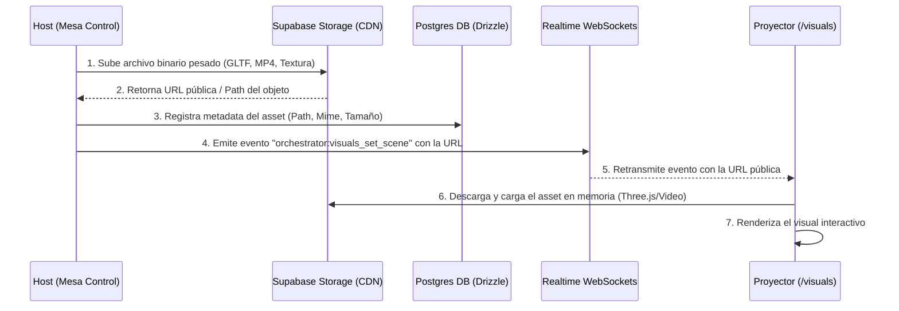

# Propósito y Visión de Visuales en Glow

Este documento describe la visión conceptual y las opciones arquitectónicas para la evolución del sistema de **Visuales** (la superficie de proyección/pantalla principal) en Glow.

---

## 1. Visión General: De Monolitos Simples a un Motor Multipropósito

Actualmente, Glow cuenta con una superficie de proyección (`room/[code]/visuals/page.tsx`) que renderiza 3 tipos de "artes" monolíticos (Canvas2D y WebGL simple). El objetivo es transformar esta superficie en un **visualizador dinámico** capaz de cargar visuales de distintas naturalezas y orígenes a través de un sistema de esquemas (schemas).

El sistema debe soportar cinco grandes tipos de visuales:
1. **Simples (Legacy / Canvas2D / WebGL directo):** Visuales reactivos a audio autoportantes con variables básicas de color y velocidad.
2. **3D Interactivos (Three.js):** Modelos 3D complejos con animaciones por estados y reactividad paramétrica.
3. **Vídeos Multi-Estado (Pre-renderizados):** Secuencias de vídeo fluidas con transiciones lógicas entre estados discrecionales (ej. niveles de energía).
4. **Vídeos Externos (YouTube/Vimeo):** Embebidos con control remoto de reproducción y reactividad sintética.
5. **Presentaciones Interactivas (PowerPoint / Google Slides / PDF):** Diapositivas controlables con capas de overlay interactivo (como WebRTC o reacciones de la audiencia) superpuestas.

---

## 2. Modelado de Visuales: El Store de Visuales y Schemas

Para poder independizar la creación de visuales del código central de la aplicación principal, definiremos un **esquema JSON de definición de visuales**. Esto permitirá en el futuro que un Store de Visuales exponga una API, y que la aplicación de Glow consuma, renderice y controle dinámicamente cualquier visual compatible.

### Estructura Conceptual del Schema (`VisualDefinition`)

```json
{
  "id": "vitruvian-super-saiyan",
  "label": "Vitruvian Super Saiyan",
  "type": "threejs", 
  "version": "1.0.0",
  "assets": {
    "modelUrl": "https://assets.glow.app/models/vitruvian.glb",
    "textures": {}
  },
  "states": {
    "min": 1,
    "max": 5,
    "default": 1,
    "definitions": [
      { "level": 1, "name": "Base State", "animationClip": "idle_base" },
      { "level": 2, "name": "SSJ Level 1", "animationClip": "idle_ssj1", "ambientColor": "#ffd700" },
      { "level": 3, "name": "SSJ Level 2", "animationClip": "idle_ssj2", "ambientColor": "#ffaa00", "hasAura": true },
      { "level": 4, "name": "SSJ Level 3", "animationClip": "idle_ssj3", "ambientColor": "#ff5500", "hasAura": true, "auraPulseRate": 2.0 },
      { "level": 5, "name": "Super Saiyan God", "animationClip": "idle_ssjg", "ambientColor": "#ff0055", "hasAura": true, "auraPulseRate": 4.0 }
    ]
  },
  "params": [
    {
      "name": "audioReactivity",
      "type": "boolean",
      "default": true,
      "label": "Reaccionar al Ritmo"
    },
    {
      "name": "auraIntensity",
      "type": "float",
      "min": 0.0,
      "max": 1.0,
      "default": 0.5,
      "label": "Intensidad del Aura"
    }
  ]
}
```

---

## 3. Debate Técnico: ¿3D con Three.js vs. N Vídeos Pre-renderizados?

Para implementar visuales con **N estados de progresión** (como la escala de energía Super Saiyan 1 a 5), existen dos aproximaciones técnicas principales. A continuación se detallan sus mecánicas y la comparativa de pros/contras:

### Opción A: Render en Tiempo Real con Three.js

*   **¿Cómo funciona?**
    El frontend carga un modelo GLTF/GLB único que contiene las mallas (mesh) y un set de animaciones del esqueleto (skeletal animations). 
    *   **Transición de Estado:** Cuando el usuario cambia del nivel 2 al 3, el motor de animación de Three.js (`AnimationMixer`) realiza un *cross-fade* (desvanecimiento cruzado) de $N$ segundos entre el clip actual y el siguiente.
    *   **Parámetros dinámicos:** Variables como el tamaño del aura, velocidad de rotación o emisión de partículas se interpolan linealmente (`lerp`) entre los valores definidos para cada estado.
*   **Pros:**
    *   **Reactividad musical instantánea:** Se pueden analizar las frecuencias del audio (bajos, agudos) y aplicar micro-deformaciones, cambiar colores de las luces o el tamaño del aura frame-a-frame de forma verdaderamente dinámica.
    *   **Transiciones infinitas e instantáneas:** Si el usuario pasa de nivel rápidamente o en orden no lineal, el motor puede hacer cross-fade entre cualquier par de estados en cualquier momento sin saltos bruscos.
    *   **Resolución independiente:** Al ser vector/3D, se renderiza con nitidez nativa en cualquier resolución de pantalla o proyector (1080p, 4K).
*   **Contras:**
    *   **Consumo de GPU/CPU alto:** El dispositivo que proyecta los visuales requiere una tarjeta gráfica decente.
    *   **Costo de producción elevado:** Requiere que el diseñador modele, texturice, asocie huesos y anime en un software como Blender optimizando para WebGL.

### Opción B: Vídeos Pre-renderizados Secuenciales

*   **¿Cómo funciona?**
    El diseñador genera renders hiperrealistas (en Blender/Cinema4D) y exporta pequeños fragmentos de vídeo:
    *   **Loops:** Un bucle de vídeo para cada estado estable ($L_1, L_2, L_3, L_4, L_5$).
    *   **Transiciones:** Vídeos puente para los caminos intermedios ($T_{1\to2}, T_{2\to3}, T_{3\to2}$, etc.).
    *   **Mecánica de Reproducción:** Si estamos en $L_2$ y el usuario incrementa a $3$:
        1. Se reproduce el vídeo puente $T_{2\to3}$ una sola vez.
        2. Al finalizar $T_{2\to3}$, se cambia inmediatamente a reproducir en bucle $L_3$.
*   **Pros:**
    *   **Rendimiento excepcional:** El navegador solo decodifica vídeo (`<video>`), por lo que funciona fluidamente incluso en hardware de muy gama baja.
    *   **Estética cinematográfica sin límites:** Se pueden usar técnicas hiperrealistas de iluminación, trazado de rayos (raytracing) y simulaciones de fluidos complejas que una GPU web no podría renderizar en tiempo real a 60 FPS.
*   **Contras:**
    *   **Pérdida de reactividad al audio:** No se pueden deformar elementos en tiempo real con los bajos o agudos. Lo máximo es alterar la velocidad de reproducción del vídeo (`playbackRate`) o aplicar filtros CSS reactivos (brillo, contraste) al elemento `<video>`.
    *   **Rigidez y retraso en transiciones:** Si el usuario pasa del nivel 2 al 5 de golpe, el sistema debe encadenar varios vídeos intermedios o hacer un corte visual tosco. Además, hay latencia inherente al cargar y reproducir archivos de vídeo dinámicamente si no están perfectamente precargados en memoria.

### Veredicto y Recomendación de Arquitectura

Proponemos una **arquitectura híbrida**: el sistema debe ser agnóstico del tipo de renderizado.
*   Para visuales abstractos e interactivos con música $\to$ usar **Three.js**.
*   Para visuales figurativos (como personajes con renderizado hiperrealista de pelo/ropa) o entornos cinemáticos $\to$ usar **Vídeos Multi-Estado**.
*   El Store de visuales definirá el `type` de visual en el JSON de metadatos, y el visualizador instanciará el renderizador adecuado (`ThreeJsRenderer` o `MultiVideoRenderer`).

---

## 4. Visuales de Terceros y Capas Superpuestas (Overlays)

Para lograr una integración fluida de YouTube e IFrames interactivos (como PowerPoints) sin perder la interactividad nativa de Glow:

### A. YouTube Player API
*   Se embebe el Iframe de YouTube ocultando los controles nativos (`controls=0`).
*   La mesa de control (host) envía comandos a través de WebSockets (`play`, `pause`, `set_volume`, `cue_video`).
*   **Audio-reactividad artificial:** Como no podemos leer directamente los datos de audio de un iframe de YouTube por políticas de CORS, la reactividad de los overlays se alimentará del micrófono del host o de un análisis local (si el audio se inyecta por otra vía).

### B. PowerPoints / Slides e Integración WebRTC
*   Se embebe la presentación mediante su enlace de publicación Web (Google Slides o Microsoft Sharepoint).
*   Se exponen controles direccionales en la mesa del host que envían eventos WebSocket para avanzar diapositiva.
*   **Arquitectura de Capas (Z-Index):**
    *   **Capa Base ($z=0$):** El Iframe de la presentación (pantalla completa).
    *   **Capa Intermedia ($z=10$):** Capa interactiva/visual del Live-Call WebRTC (mosaicos de vídeo con transparencia, bordes redondeados y efectos CSS premium).
    *   **Capa Superior ($z=20$):** Efectos flotantes de reacciones (emojis que suben por la pantalla) y notificaciones de marca.

---

## 5. Arquitectura de Distribución de Archivos (Sincronización Host-Proyector)

Un reto clave es que el panel de control (Host/Mesa de Mezclas) suele ejecutarse en un dispositivo (ej. laptop o móvil del DJ) diferente al de la pantalla de visuales (Proyector/TV en `/visuals`).

Para resolver la subida y renderizado de archivos dinámicos (3D, texturas, vídeos personalizados) sin saturar la base de datos relacional de Postgres, la arquitectura sigue este flujo:

### Flujo de Datos para Carga de Assets


### Estrategias de Optimización y Almacenamiento

1. **Base de Datos Ligera (Metadata):** Postgres **nunca** guarda los archivos binarios. Solo almacena filas de metadatos (unos ~200 bytes por registro en `room_media_assets`) apuntando a la ruta del Storage.
2. **Supabase Storage (Object Storage):** Los archivos de los usuarios se suben de forma persistente a buckets privados/públicos según corresponda, optimizados para entrega rápida a través de CDN.
3. **Limitación de Recursos según Plan (Monetización y Control de Storage):**
    Para evitar un crecimiento desmedido e incontrolable del almacenamiento en la nube, se aplican las siguientes reglas:
    * **Límite de Peso Máximo:** Cada archivo subido tiene un límite estricto de megabytes (ej. máximo 10MB para modelos 3D y 25MB para videos), configurado por plan.
    * **Límite de Cantidad de Recursos:** Cada equipo/usuario tiene un número máximo de "recursos subidos" permitidos de forma simultánea según su suscripción (ej. Free: 2 archivos, Plus 25: 10 archivos, Pro: 50 archivos).
    * **Lógica de Multiplicador para Vídeos Multi-Estado:** Si un visual de tipo Vídeo requiere $N$ estados (ej. 5 vídeos correspondientes a los 5 niveles de energía), subir este visual consume $N$ recursos de su límite disponible.
    * **Gestión Manual de Espacio:** No se eliminan archivos de forma automática tras cerrar la sala (Garbage Collection descartado). Los recursos permanecen guardados de forma persistente para que el usuario pueda reutilizarlos. Si el usuario alcanza su límite de almacenamiento, el panel de control bloqueará nuevas subidas y le obligará a **eliminar manualmente** recursos antiguos para liberar espacio.

---

## 6. Próximos Pasos para la Discusión

1.  **Prioridad de Implementación:** ¿Qué tipo de visual es el más crítico para el siguiente hito? (¿El motor 3D de N-estados o la integración de YouTube/Slides?).
2.  **Pipeline de Assets para Diseñadores:** ¿Queremos definir un flujo de exportación estándar en Blender (por ejemplo, nombres obligatorios de animaciones en el GLB como `idle_1`, `transition_1_2`) para que Three.js los interprete automáticamente?
3.  **Monetización del Store:** ¿Los visuales del store se asociarán a la suscripción del room, o serán compras "a la carta" (Pay-per-visual)?
